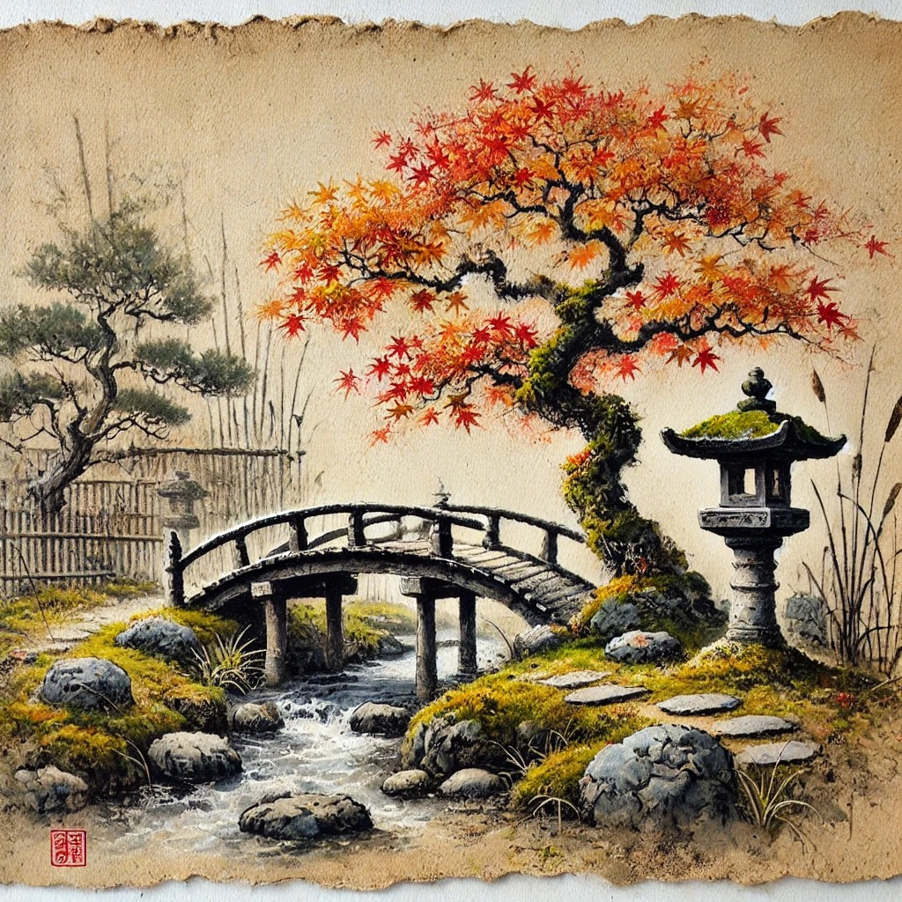

# The Garden of Threads — Web Experience Specification

**Source story:** (see Appendix 1)
**Author:** R. E. Warner  
**Format:** Single-page web experience (HTML/CSS/JS, no framework required)  
**Target:** Public — fully responsive, mobile-first

---

## Vision

A meditative single-page reading experience for the short story *The Garden of Threads*. The reader advances section by section at their own pace. The visual environment shifts across three seasonal phases as the narrative moves from open summer through autumn fire to winter stillness. Generative ambient music evolves continuously underneath. The ending fades to near-silence and near-blankness — quietly unresolved.

The experience should feel painterly and unhurried. Not a slideshow. Not a scroll. A garden you walk through one step at a time.

---

## Visual Identity

### Title Image (provided)

The author's title image is a watercolor-on-aged-parchment painting that contains the story's key physical elements:

- An arched wooden footbridge over a rocky creek bed
- A blazing red-orange Japanese maple
- A moss-capped stone lantern beside a stand of reeds
- A bamboo fence in the soft background
- Rocks, moss, grasses throughout
- Painted on deckle-edged aged paper with warm parchment tones
- A small red artist's seal stamp in the lower left corner
- Style: East Asian ink-and-watercolor — detailed but loose, grounded in ink line

**This image is the visual DNA of the entire experience.** Its palette, texture, and elements should inform every design decision. The parchment ground color (`~#e8d9b5`) is the base. Ink blacks, moss greens, burnt oranges, and deep reds are the accent palette.

### Texture & Surface

All visual panels should feel like they exist *on* aged paper — slightly textured, warm, never clinical. SVG or CSS paper grain overlay is acceptable. The edges of painted elements can bleed softly, as watercolor does.

### Typography

- Body text: a serif with warmth — suggestions: *Lora*, *EB Garamond*, or *Crimson Pro* (Google Fonts)
- Display/title: same serif, larger, possibly with slight letter-spacing
- Text should feel like it is appearing on the page, not projected on a screen
- Color: deep ink brown-black (`~#2a1f14`) on the parchment ground
- Text panels: semi-transparent parchment card, soft shadow, never a hard white box

---

## Seasonal Arc

The story passes through three visual phases. The transition between phases should be gradual — cross-fading painted elements, shifting the color temperature of the background, changing particle behavior.

### Phase 1 — First Visits (Sections 1–3)
*Open, airy, early season. Whites and yellows in the garden. The narrator is still a stranger.*

- Background: warm parchment, lighter and more open
- Botanical elements: soft greens, pale blossoms, gentle grasses
- Particles: occasional slow-drifting petals or seeds (white/pale gold)
- Music: sparse, open — single tones with long decay

### Phase 2 — Autumn / The Conversations (Sections 4–10)
*The maple turns to fire. The monk speaks. The relationship deepens.*

- Background: richer parchment, deeper ochres and warm shadow
- Botanical elements: reds, burnt oranges, deep greens — the maple dominant
- Particles: maple leaves drifting and falling, unhurried
- Music: fuller, harmonically warmer — a low drone enters, soft melodic motion

### Phase 3 — Winter / Loss (Sections 11–14)
*Snow. Shorter days. The sunset meditation. Then the empty alcove.*

- Background: cooler, desaturated parchment, grey-blue undertone
- Botanical elements: bare branches, muted moss, snow suggestions
- Particles: very slow, sparse — occasional snowflake or bare leaf
- Music: dissolving — tones lengthen, thin out, approach silence
- Final section (monk gone): background fades toward near-white parchment. Painted elements ghost and recede. Music reduces to a single sustained tone, then silence.

---

## Story Sections

Divide the story into the following 14 sections. Each section is one "card" or "beat" the reader advances through.

1. **Arrival** — *"In the eastern part of the city…"* through *"…meditating."*
2. **The Bridge** — *"I found a spot in the southwestern corner…"* through *"…think nothing."*
3. **Seeing the Monk** — *"The monk nearest that spot…"* through *"…knowing each other's names."*
4. **The Invitation** — *"He stayed in that spot…"* through *"…I supposed I felt gratitude."*
5. **The Ritual** — *"The next Saturday and the next…"* through *"…I was on my way."*
6. **The Voice** — *"The following Saturday he spoke…"* through *"…what the Beatles think."*
7. **Karma** — *"Your karma is a wave…"* through *"…I resolved to find out."*
8. **The Thread** — *"The monk spoke again…"* through *"…Thank you."*
9. **Surfing** — *"The next Saturday he seemed…"* through *"…it may drown you."*
10. **The Corkscrew** — *"The reed that does not bend…"* through *"…unique only to you. This, too, is your Karma."*
11. **Winter** — *"The garden had begun to turn itself to winter…"* through *"…the line between the stone and snow."*
12. **Threads Converge** — *"After a while, the monk said…"* through *"…I like my long, smooth wave."*
13. **The Sunset** — *"And that you feel that compulsion…"* through *"…weaving my thread briefly into it."*
14. **The Empty Alcove** — *"I came back the next Saturday…"* through the end.

---

## Navigation & Interaction

- **Advance:** Tap anywhere on screen, click, or press Spacebar / Arrow Right
- **Step Back:** A lifted corner of the paper in the bottom right corner of the screen goes back to the last section.
- A subtle progress indicator: a thin horizontal thread drawn across the bottom of the screen, growing from left to right. Style it as an ink line, slightly irregular, not a mechanical progress bar.
- A small, unobtrusive **sound toggle** (on/off) in a corner — default: **on**
- No other UI chrome. No header. No scrollbar. No visible buttons beyond the sound toggle.
- On mobile: tap anywhere advances. The sound toggle is reachable in a corner.

### Text Reveal Animation

When a new section appears:
- Text fades in gently over ~800ms, as if ink is bleeding into paper
- Do not slide or zoom — only dissolve
- The painted background elements may shift subtly (slow parallax or cross-fade) as sections advance
- Threads are drawn and erased across the view area, swarming at the peak of transition and disappearing at the end.
- Elements can blow across the view area as indicating a change.

---

## Sound Design

All audio generated in-browser using the **Web Audio API** — no audio file downloads.

### Generative Music Engine

The music should feel like it is being improvised quietly in an adjacent room. It never repeats exactly. Guidelines:

- **Instrument character:** Soft sine/triangle oscillators with slow attack and long release — resembling a singing bowl, a bowed string, or a breath flute. No sharp attacks.
- **Harmonic center:** Pentatonic or modal scale (suggested: D pentatonic minor or A Dorian). Never dissonant.
- **Behavior:**
  - Phase 1: 1–2 tones at a time, long silences between, very slow tempo
  - Phase 2: 2–3 tones occasionally layered, a quiet low drone enters
  - Phase 3: tones lengthen and space out, drone fades, approach silence
  - Final section: single held tone, very quiet, then fade to silence over ~10 seconds
- **Transitions:** Music shifts phase gradually over 2–3 section advances, not abruptly

Tone.js is acceptable if the developer prefers it over raw Web Audio API.

---

## Particle System

Lightweight canvas-based particles layered over the painted background. Should feel organic, not digital.

- **Phase 1:** 3–6 pale petals or seeds drifting slowly downward, slight horizontal drift
- **Phase 2:** 5–10 maple leaves — varied reds and oranges, slight rotation, unhurried fall
- **Phase 3:** 2–4 sparse snowflakes or bare leaf fragments, very slow, nearly still
- **Final section:** Particles fade out entirely, leaving stillness

Particles should be SVG-based or drawn on canvas — hand-drawn feel, not geometric circles.

---

## Title / Opening Screen

The experience opens on the title image (the watercolor painting, full-bleed or nearly so), with:

- Title: **The Garden of Threads** — set in the chosen serif, large, centered, ink-dark
- Byline: *R. E. Warner* — smaller, beneath
- A very subtle instruction: *"tap to begin"* or simply a gentle pulse on the progress thread at the bottom
- Music begins softly as soon as the page loads (or on first tap if autoplay is blocked)
- The title image should be the `og:image` for social sharing

The Image:

---

## Closing Screen

After Section 14 (the empty alcove), one final state:

- Background fades to near-white parchment — almost blank
- No particles
- No music (or a single nearly-inaudible held tone)
- A single line of text, centered, in a smaller size:

  > *I don't go to that garden anymore.*

- After ~4 seconds, a second line fades in beneath it, even smaller, lighter:

  > *— R. E. Warner*

- No "restart" button. No links. Just stillness.
- Optional: a very faint watermark of the stone lantern, barely visible in the parchment

---

## Technical Notes

- **Single HTML file** preferred (inlined CSS and JS), or a minimal file structure (index.html + one CSS + one JS)
- **No build tools required** — must work by simply opening the HTML file or serving statically
- **No external dependencies required**, though Google Fonts (for typography) and Tone.js (for audio) are acceptable
- The title image (`watercolor-garden-of-threads.webp`) should be included as an asset and referenced locally — do not hotlink from Medium
- **Performance:** Particle system and audio must not cause jank on mid-range mobile. Keep particle count low. Use `requestAnimationFrame` correctly.
- **Autoplay policy:** Handle browser autoplay restrictions gracefully. If audio cannot start automatically, begin on the first user interaction without interrupting the experience.
- **Accessibility:** Provide a way to read the full story text without the experience — either a hidden `<article>` element with all text for screen readers, or a `?text=true` URL parameter that renders plain readable text.

---

## Deliverable Checklist

- [ ] `index.html` (and any companion files)
- [ ] `watercolor-garden-of-threads.webp` in an `/assets` folder
- [ ] Works on Chrome, Firefox, Safari (desktop and mobile)
- [ ] Sound toggle functional
- [ ] All 14 sections present with correct text
- [ ] Three seasonal phases visually distinct
- [ ] Closing screen fades to stillness correctly
- [ ] Progress thread visible throughout
- [ ] No console errors on load

---

*Specification written for R. E. Warner, April 2026.*

## Appendix 1

# The Garden of Threads

## A Short Story by R. E. Warner

In the eastern part of the city there was a small hill and at the top of that hill was a Buddhist temple. The garden at the center of the temple was open to the public. The first time I visited the garden I knew I would be back again and again. It was beautifully designed. Everywhere you could stand there was some beautiful vista. I was told the garden was also landscaped to change with the seasons. I wanted to witness that. And there was one last intriguing accouterment. All along the outer edges of the garden, along the outermost stone path there were alcoves, and in most of the alcoves sat a monk on a pillow in bright orange robes, meditating.

I found a spot in the southwestern corner of the garden that I loved. It was a small footbridge over a dry creek bed of carefully arranged stones. I don’t know why that place spoke to me but it did. There was no water but I could hear it. I returned Saturday after Saturday and I could use the bridge to measure changes in all the plants on either side of the creek bed. When it rained, I would wear my raincoat and the patter of raindrops on my head made the view more calming still. Sometimes I would contemplate some problem or maybe some story I might want to write, but most times I felt a strong urge to let thoughts pass and think nothing.

The monk nearest that spot was hardly visible in my peripheral vision, tucked away in his alcove. I could see the bright spots of color that were his knees and that was all. One particularly clear day though, the wind at the top of the hill just teasing the garden life, the monk was sitting out in front of his alcove in full view. It was a curious feeling that now that I could see his face, his eyes closed in meditation, I could feel his presence more. It is a rare but pleasant interaction to sit or stand in contemplation with someone else but speak no words. It felt like we were in agreement of something without ever discussing it or even knowing each others’ names.

He stayed in that spot for a few Saturdays as the garden shifted its flavor to Autumn. The bridge and the creek bed remained my anchor but the colors around the cherry wood structure went from whites and yellows to purples and reds. A maple past the bridge turned to fire; it had suddenly become a brilliant shade of orange. It was around that time that I heard the faintest sound:

*“Pssst.”*

It was a distinctly human sound and I turned to its source only to see the bright eyes of the monk staring right at me. His hand lifted from his lap and he gestured to his left where there was now a second pillow. The gesture was clear and I could not resist the invitation. I bowed a little—I don’t know why. It felt appropriate and he smiled. I slid my sneakers off and sat next to him. When I turned to him, I supposed for some kind of further instruction, his eyes were already closed again. So I took a deep breath and contemplated the garden from this new angle. There was a surprising amount of new things to see from lower to the ground and ever-so-slightly more north. I could still see the top of the arch of the footbridge and the brilliant maple but no longer the creek bed. Perhaps ten feet in front of me there was a small stone lantern being hugged by moss and tucked into an archway of reeds.

I don’t know how long I sat there but at some point I felt the urge to move, so I stood, put my sneakers on and turned to the monk. His eyes remained closed, but again for some reason unknown to me I bowed and this time more deeply. Our agreement thus silently expanded, I supposed I felt gratitude.

The next Saturday and the next Saturday, the second pillow remained and I would join him, for an hour or so and then be on my way. The second Saturday we didn’t even make eye contact. I can’t be sure he even knew that I came and went. But the third Saturday maybe because it was cloudy, he watched me sit down and we smiled and nodded at one another and he seemed genuinely happy to see me. We said nothing still and then I was on my way.

The following Saturday he spoke. I took off my shoes and sat. I straightened my back as if I were being pulled by a string coming out of the top of my head. He had his eyes closed but as soon as I looked at the little hidden lantern, I heard his voice for the first time. It was not what I expected. Whereas I would have anticipated a light airy tone, it was tenor. And there I would have expected an accent, he sounded quite Western American with only a hint of a Japanese accent. “Do you know what your karma is?”

I felt like he was asking me what I thought my future was. I responded, “I suppose not. Karma is the good I put into the world coming back at me?”

“Nah,” he said. “That’s just what the Beatles think.”

I had no response to this. He knew the Beatles. A little bit of “Instant Karma” played in my head.

“Your karma is a wave. Much of it comes from behind you, carrying you. It is all the things you could not choose for yourself. It is your parents and your parents’ parents and your parents’ parents’ parents and on and on. It is good to be grateful toward your ancestors because they were all survivors. If any one of them had died before they procreated, you would not exist; at least not the way you are now.”

I thought on this and remembered a story I was told once about an Irish ancestor of mine on my mother’s side. He arrived by ship in America and walking—*walking*— from New York City to Detroit for work. He was a blacksmith. I didn’t know more details than this. Not the year. Not his name. I resolved to find out.

The monk spoke again. “You cannot choose your class, your culture, what language or languages you will first speak. You cannot choose if you will be petty of homely and you will not choose initially to be raised in such a fashion that you will appreciate the advantages of both. This is your karma. I would even say it brought you right here.” He opened his arms and hands out to the garden.

I thought about that for a while. What had brought me to the temple garden? I could think of a brief chain of events that had brought me here. I had a good friend who upon hearing my appreciation for landscape architecture at lunch told me about the temple. But as to why we were at lunch, I had no memory. I couldn’t even remember what I had eaten. My head went quiet after that and after a while it was clear that the monk had nothing more to say. When I felt like it, I got up to leave. I put my shoes on and turned to bow. This time he bowed in return and I said, “Thank you.”

The next Saturday he seemed to be waiting for me, excited. I hadn’t even sat down all the way when he asked, “Did your karma return you here?” The tone with which he asked the question made it clear he was joking.

I smiled and responded, “I suppose so.”

His next question was as baffling as his mention of the Beatles. “Do you know how to surf?”

I shrugged. “Not well. When I lived on the coast, I took some lessons.”

“Good. Then it will make some sense to you when I say that you must surf your karma.”

I didn’t really understand and he could see it. He nodded while looking at the garden. There is the wave behind you and there is an invisible wave before you.” He took a deep breath and thought. Then, “Somewhere, even now, an event is occurring, and it is headed toward you. You cannot know when or in what form it will arrive or how it will change the shape of the wave you are on. Consider the first time I decided to speak to you. Now I, too, am part of your karma. Some of these invisible events will bear malice or sadness but if you surf your karma, do not resist, stay steady and balanced, you will pass over it. Resist and it may drown you.”

“The reed that does not bend, breaks,” I said.

“You understand me,” he replied.

A little later on he said, “Many people accept that the Earth goes around the Sun. But because they do not know, they often do not consider the Sun’s own journey through the galaxy. So, really, the Earth’s orbit is not so much an ellipse as it is a corkscrew.”

I could see this in my head. I had to admit it was a brand new way for me to conceive of my place in the Universe.

“Somewhere back there?” And he pointed at the ground away from the Sun, pointed in a slightly different direction, “Or maybe back there.” He looked to me and said, “There is a set of space-time coordinates where you were born. In fact, if I were far enough away and had a big enough magnifying glass, I could watch it happen.” He smiled at this and raised his eyebrows. “Somewhere that way...,” he pointed past the Sun. “There is a set of space-time coordinates where you die.” He took a moment to close his eyes, bow his head, and sat in silence almost out of respect for my eventual death.

He continued. “You have also moved all over this Earth that is chasing the Sun that is going around the galaxy.” His finger traced a looping jiggling line in the air. I could see it. “You will trace a thread of being through this Universe unique only to you. This, too, is your Karma.”

I felt true awe in considering myself as a unique thread in the Universe. If I had a genetic clone and some mad scientist from the future made my clone follow my every footstep, his path would still not be the same as mine.

The garden had begun to turn itself to winter. The maple fire has begun to go out. There was more brown than any other color. We even had an early unexpected snow. Part of me didn’t want to go to the garden that weekend. Surely even the monks had snow days. I reasoned that the garden trips had become too much of a loop in my life which was outright silly when I considered all the other days of the week. I resolved to go out and put on layers of clothes and wool socks and boots.

When I arrived, the monk was wearing the same clothes as always. The Sun had come out and the little snowflakes were already melting. I sat down, we nodded at one another. I looked to the stone lantern, hidden in its reeds. The snow had not touched it. There was a small semi-circle of white before it, just as before the monk and I, there was a line of snow where the eve of the stone tile roof ended.

“I think we should not talk about your karma today,” he said after a few minutes.

It was a long, cold walk up to the temple. It was cold now. I wasn’t uncomfortable in all my layers. I looked from the stone lantern at the ground in front of me, at the line between the stone and snow.

After a while, the monk said, “You have seen much of your thread.”

This was true. The idea of it had me in its grasp. All during the week my mind had been meandering into the past. I tried to figure out what had been my first memory. I remembered accidents and injuries. I remembered a time I had been bitten by a snake—not a poisonous one—but I had to get a tetanus shot anyway. I remembered a time I jumped off a bridge into a lake. The exhilaration I felt was an echo but I remembered the fear and then the relief of hitting the water and then the joy as my friends and I surfaced and splashed and hollered and laughed. I remembered my first kiss. The girl I was with kissed me and I wasn’t really prepared for what happened to my entire body like an electric shock.

“Yes,” I said quietly, barely even present.

“Perhaps you have seen the myriad of threads that converged toward your birth. Perhaps you have seen how some threads can intertwine?”

I confessed that actually I had not thought about these things. I had only thought about myself. Not that he had said it though, I could see the geometry of it, intricate, beautiful. I saw that my birth was but an intersection of several threads. My mother, my father, even the doctor who likely went on to intersect the beginning of many threads. I said to the monk, “I can even see a new thread branching off of mine.”

The monk shrugged, “Or you could adopt.”

I chuckled because this was true and I could see a new geometry. I turned to him and squinted, “Do you suppose your thread will end... I mean... somewhere else in time and space.. but here?” I pointed down at the ground.

“Probably not right here,” he said and pointed at the same place as me. He contemplated that spot for a moment. “Okay, *maybe* right there. “But it is true my thread has become very smooth and loops and loops like a sine wave multiplied. Through this temple, my thread has been woven into a rope. It may—my thread—end here. I don’t know. You decide to leave our meditations. Something compels you. I never know when but sometimes I suspect it before it happens. Perhaps one day I will feel that compulsion. I haven’t felt it yet in many years. I like my long, smooth wave.”

“And that you feel that compulsion and I observe it and do not have it does not mean I am judging you. We must see that others have their wave and that we cannot know their wave. Perhaps they are surfing. Perhaps they are drowning. Perhaps they bring malice to because they are trying to rid themselves of it or cannot see it. Perhaps they bring sadness because their karma has made a messenger of them. We cannot know and should not judge. Surf over these waves or ride them a while. Another wave will come.”

That day, partly because it was now windier and the days were getting shorter and partly because of what he had said, I sat with him longer than usual, until the Sun was setting on the temple. I was so glad I did. Among sunsets I remember, it was special. I didn’t leave right away either. I made one loop around the garden, taking in how it had changed in the fading light, weaving my thread briefly into it.

I came back the next Saturday. The cold had let up a bit. The little snowfall was gone and so was the monk and the two pillows. I stood facing the alcove and wondered. Was it me? Was he gone? Did he get in trouble for speaking to me? Did he leave? I strolled around the garden looking sideways at monks in the alcoves and I didn’t see him. I felt almost foolish looking for him, like a lost dog. Still, I came back the following Saturday and the one after that.

I don’t go that garden anymore. I don’t even live in that city anymore. I visit other gardens. I think about him. If I ever returned to that city to visit I would go back to the temple and I know that if I saw him it would be a joyous reunion even though I don’t know his name.