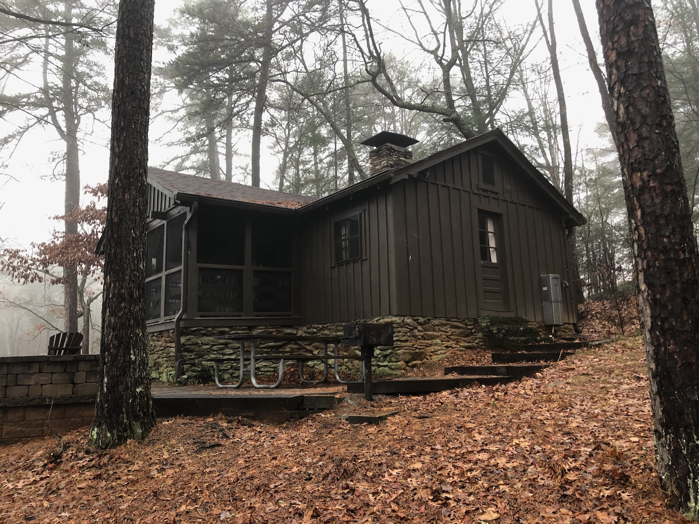

# A Cabin With Walls That Were Not There

One of the most difficult things to do when starting out with a meditation practice is quieting your thoughts. While I won't delve into meditation lessons, take a brief, thirty second pause here, with your eyes closed.

You are likely to find that your brain will introduce thoughts like things you need to do, some errant memory or earworm, something you desire, etc. This is a busy mind and it’s natural. How many of those thoughts were questions you wanted answered or weird trivia you wanted to verify? A while back, I stayed at a cabin without internet, and I noticed an entirely different mental phenomenon from having a busy mind. Nor was I put off by a silent mind. There was an unsettling feeling of being walled in beyond the heavy log walls of the cabin.

Don’t mistake me for being a back-to-the-Earth naturalist either. I had a laptop, an iPad, and my iPhone. (I also had two paper books.) I had intentions of writing, reading and hiking. I’m familiar with the term FOMO, but that, to me, has more to do with seeing whatever is on the social networks and knowing you’re missing out. I didn’t have any social networks to let me know what I missing. Plus, I meant to be missing out on the news. This eerie silence should have felt welcome—I had pursued it, after all. I’ve been trying to put my finger on the feeling since I experienced it, and concerning most things having to do with media, I asked WWMMT (What Would Marshall McLuhan Think)?

McLuhan's observations about media go beyond popular recognition. His thinking goes, media are extensions of ourselves: the alphabet an extension of our speech, the wheel an extension of our legs, television an extension of our sight. Much like wireless headphones cutting off your music when too far from your device, the feeling is disruptive, akin to amputation. Your car breaking down is equally if not more crushing. And now, we are entering an era where our media our extensions of our minds.

That was more the feeling I had in the cabin. I could watch a movie, read a book, write an essay—there was no FOMO, no boredom, no ennui. However, it did feel like part of my mind had been amputated, namely; the part that could answer any question, give me any name, take me anywhere in history. While writing, I had to leave brackets where I needed to fill in some fact or thought later during the writing process.

The eerie feeling left me after a few days, but there I was, contemplating what it had been and what it meant for us going forward. While we typically think of ourselves as having five senses, neurologists have been identifying additional senses for years. Most neurologists would tell you that we have on order of twenty or more senses. There’s proprioception—the sense of where your body is in space. There’s equilibrioception, your sense of balance. Some individuals have been shown to have [magnetoception](https://www.news-medical.net/news/20190320/Evidence-of-magnetoreception-in-humans-suggests-subconscious-ability-to-respond-to-Earths-magnetic-field.aspx), or the ability to detect magnetic fields. 

As we continue to explore the brain and potential uncover more of these senses, we will also be able to develop the technology to use and manipulate and *extend* them? Perhaps, as the example of the internet-free cabin taught me, what will it feel like to lose these extensions? As we increasingly exist in a more media dense world, we are finding that it may be causing more problems than we realize. How much anguish are our social networks really responsible for, and how much anguish might their disappearance cause as well?

This is all food for thought at the moment, but I would love to coin a term for the feeling I experienced—the inability to flex a mental muscle I had grown all too accustomed to. On some level, I recognize that it might just be a form of sensory deprivation. However, as McLuhan wisely pointed out, our media inventions tend to be two-way streets. “The medium is the message” was the cryptic mantra that emerged from his work, and I, for one, am still puzzling over it.