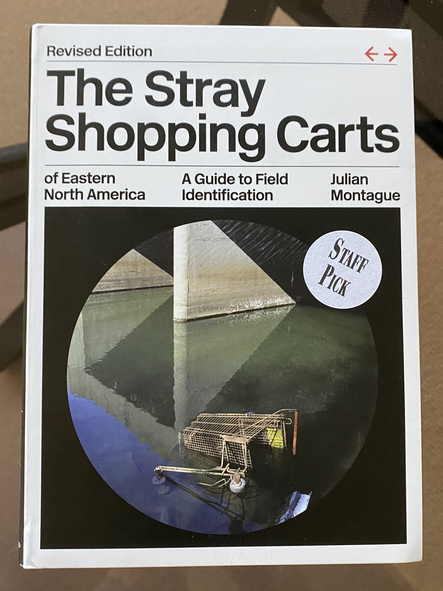
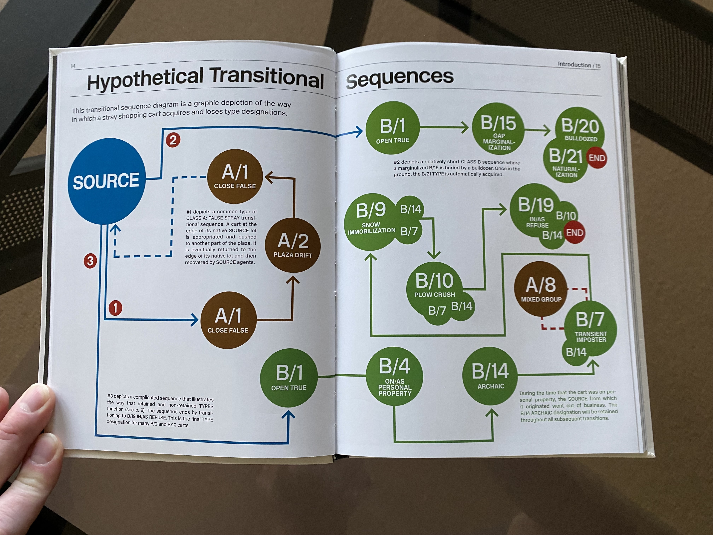
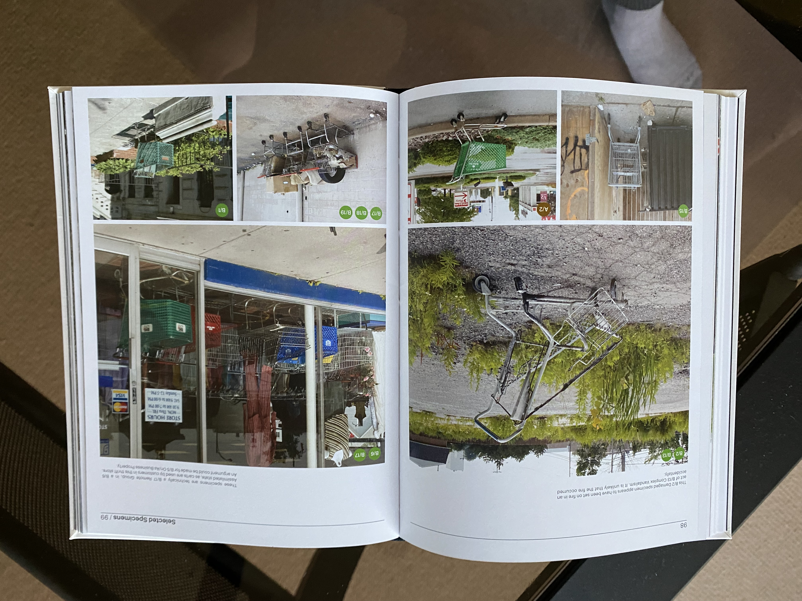

# A Stray Shopping Cart Safari

Now an then, for creative purposes, I need to stray a little aways from the stated Banapana theme of “Our Minds on Media.” I also find that some of the subjects I write about like advertising and putting microchips in our heads give me agita, and I need a break if I’m going to keep consistently writing. And I’m not entirely sure that Marshall McLuhan would not argue that shopping carts are a medium! He certainly made the argument that the wheel was a technological extension of the foot and therefore a medium; the shopping cart is an extension then of the foot and back. If human history had taken some different development track in which we never developed a consumer culture—a really difficult hypothetical for me to imagine—would the shopping cart even exist? It’s an artifact of us, but also our economy.

And what happens to these artifacts of economy in nature? To answer that question, it is best to turn to “The Stray Shopping Carts of Eastern North America” by Julian Montague.

This beautiful tome is either the result of a sincere artist or a wry comedian; I’m honestly not sure which. Upon receiving this as a Christmas gift from my sister, I was immediately reminded of books like “[How to Sharpen Pencils: A Practical & Theoretical Treatise on the Artisanal Craft of Pencil Sharpening for Writers, Artists, Contractors, Flange Turners, Anglesmiths, & Civil Servants](https://www.goodreads.com/book/show/18921553-how-to-sharpen-pencils)”—whew!—by David Rees. When I first randomly encountered this book at Powell’s Bookstore, I was *angry* and pulled it off the shelf and rifled through it with fury. This artisanal crap had gone too far! Then, I found the chapter on how to break into a friend’s place and sharpen *their* pencils and the word “SATIRE” blinked on and off in my vision. Mr. Rees is willing to wink at the audience to let us know what’s up. Mr. Montague, on the other hand, doesn’t flinch. Reading the Afterword, one find that this is serious social commentary. No offense to him, I can’t help but read it as dry wit and I find it hilarious.

The book is gorgeous.

I adore the fact that it presents a sincere identification system. This accomplishes two things. One, it presents an opportunity for the author to show a lot of photos of shopping carts that is not just a random collection. The overlay of logic helps to give reason and order to the collection, like a Linnaean taxonomy system. Anyone can present a pile of animal photographs; placing them in different relations to one another makes it an investigation. Two, (and I think this was an unintended result) it makes for a great safari guide!

