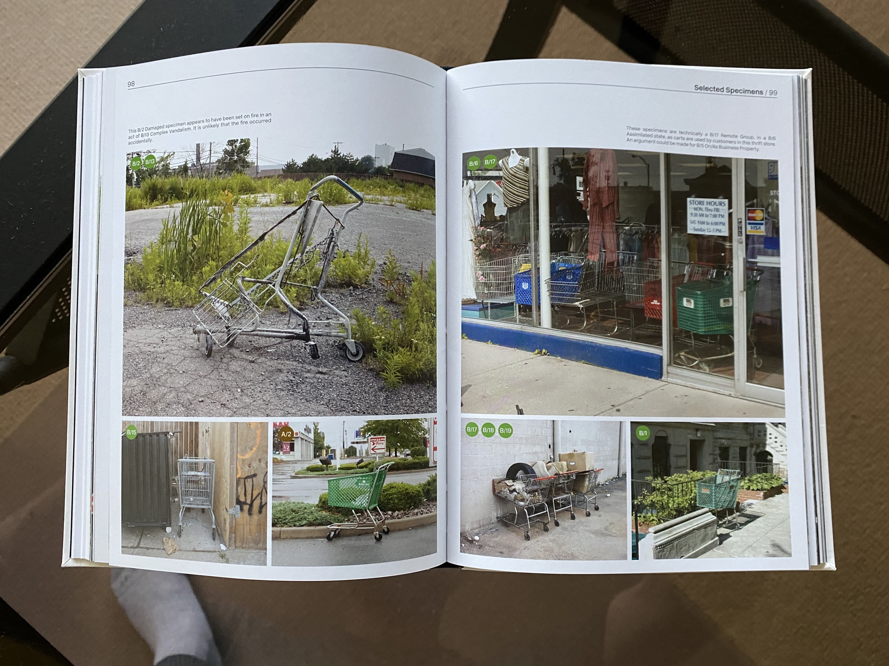
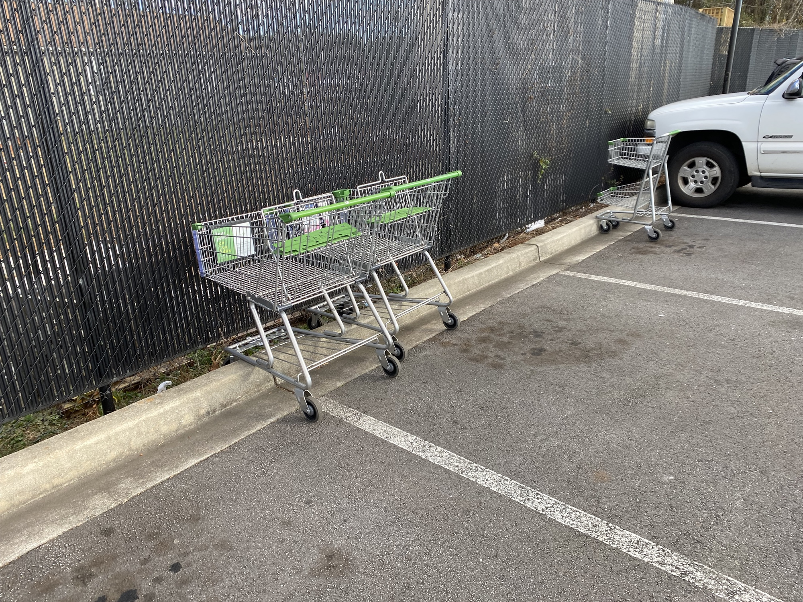
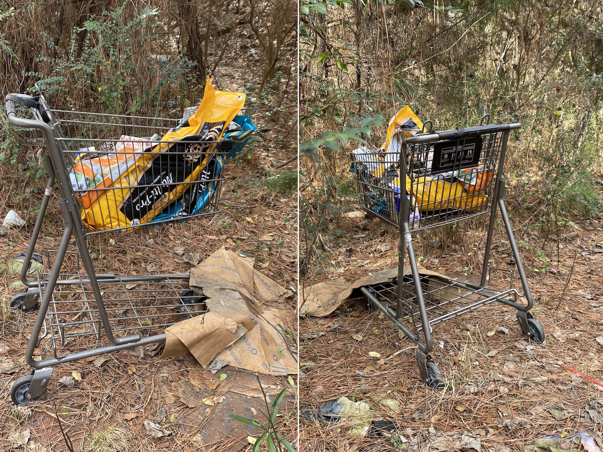

# A Stray Shopping Cart Safari

Now and then, for creative purposes, I need to stray a little ways away from the stated theme of Banapana: “Our Minds on Media.” I also find that some of the subjects I write about, like advertising, and putting microchips in our brains gives me agita. I need a break if I’m going to keep consistently writing. And I’m not entirely sure that Marshall McLuhan would not argue that shopping carts are a medium. He  made the argument that the wheel was a technological extension of the foot and therefore a medium. Does this not make the shopping cart an extension then of the foot and back. If human history had taken some different development track in which we never developed a consumer culture—a really difficult hypothetical for me to imagine—would the shopping cart even exist? It’s an artifact of us, but also our economy.

And what happens to these artifacts of economy in nature? To answer that question, it is best to turn to “[The Stray Shopping Carts of Eastern North America](http://www.montagueprojects.com/#/the-stray-shopping-carts-book/)” by Julian Montague.

This beautiful tome is either the result of a sincere artist or a wry comedian; I’m honestly not sure which. Upon receiving this as a Christmas gift from my sister, I was immediately reminded of books like “[How to Sharpen Pencils: A Practical & Theoretical Treatise on the Artisanal Craft of Pencil Sharpening for Writers, Artists, Contractors, Flange Turners, Anglesmiths, & Civil Servants](https://www.goodreads.com/book/show/18921553-how-to-sharpen-pencils)”—whew!—by David Rees. When I first randomly encountered this book at Powell’s Bookstore, I was *angry* and pulled it off the shelf and rifled through it with fury. This artisanal crap had gone too far! Then, I found the chapter on how to break into a friend’s place and sharpen *their* pencils and the word “SATIRE” blinked on and off in my vision. Mr. Rees is willing to wink at the audience to let us know what’s up. Mr. Montague, on the other hand, doesn’t flinch. Reading the Afterword, one find that this is serious social commentary. No offense to him, I can’t help but read it as dry wit and I find it hilarious.

The book is gorgeous.

I adore the fact that it presents a sincere identification system. This accomplishes two things. One, it presents an opportunity for the author to show a lot of photos of shopping carts that are not just a random collection. The overlay of logic helps to give reason and order to the collection. Like a Linnaean taxonomy system, any one can present a pile of animal photographs, but placing them in relation to one another makes it an investigation. Two, (and I think this may be an unintended result) it makes for a great safari guide!

So, book and phone in hand, I headed to the nearest supermarket near me. My first encounter was to be expected. I had merely parked in the grocery store parking lot and immediately I found three Class A, false strays.

From there, I ventured into the surrounding woods behind the supermarket complex. Not surprisingly, within 200 yards of the main parking lot, I discovered this specimen. According to the guide, since this cart is within “two blocks” it should be categorized as a close false. However, an examination of the close false carts in the above photo reveals green handles and seat flaps. This might indicate that the cart in the woods is from elsewhere. So, at the moment, the categorization of this stray cart remains fuzzy to me. I intend to check on it again in a matter of weeks.

Thanks to the early work of [Julian Montague](http://www.montagueprojects.com) and his [stray shopping cart project](http://www.montagueprojects.com/the-stray-shopping-cart-project/) I hope to further my own research to other shopping complexes in the area and find more strays. Stray shopping cart safaris such as these can take hours of time and careful orienteering when looking for the truly outlying stray. Luckily, unlike many fauna stray carts do not spook easily. I’ll return with more updates as the hunt progresses. Until then, happy shopping!

