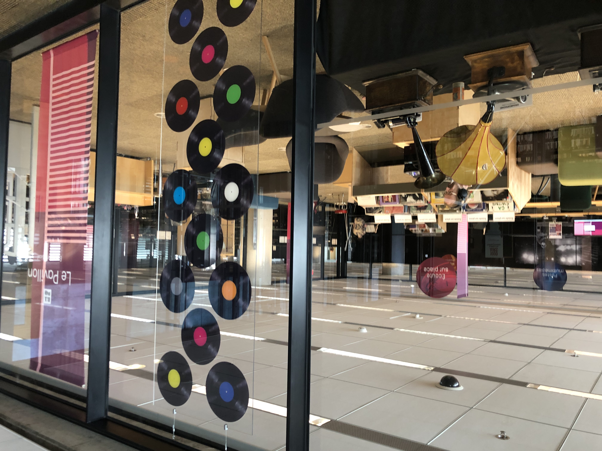
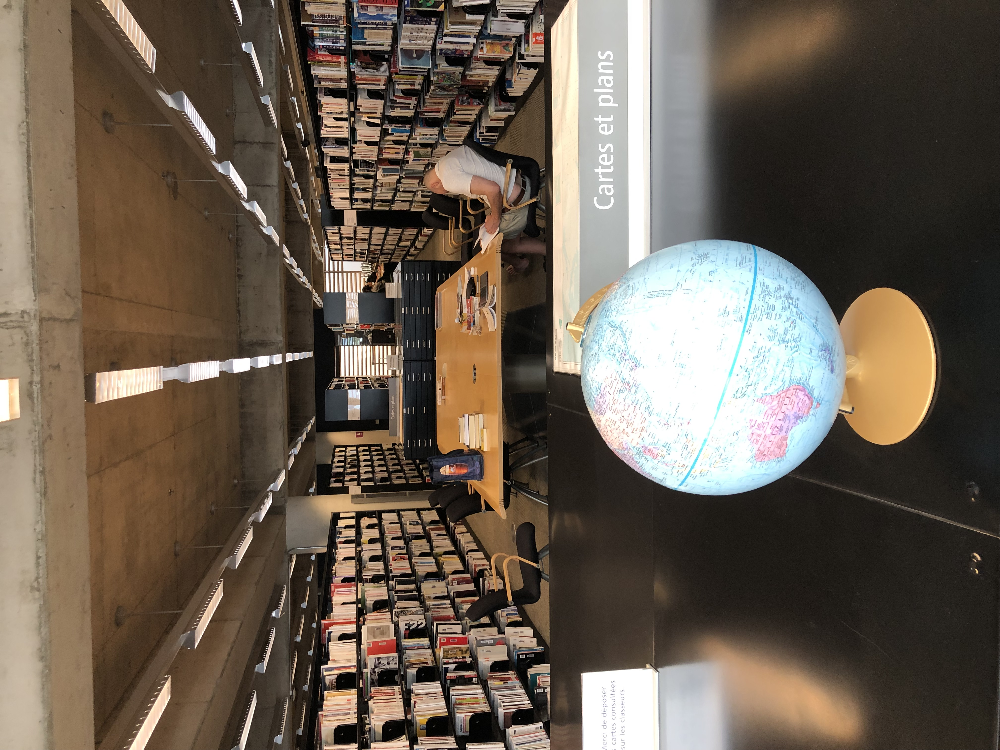
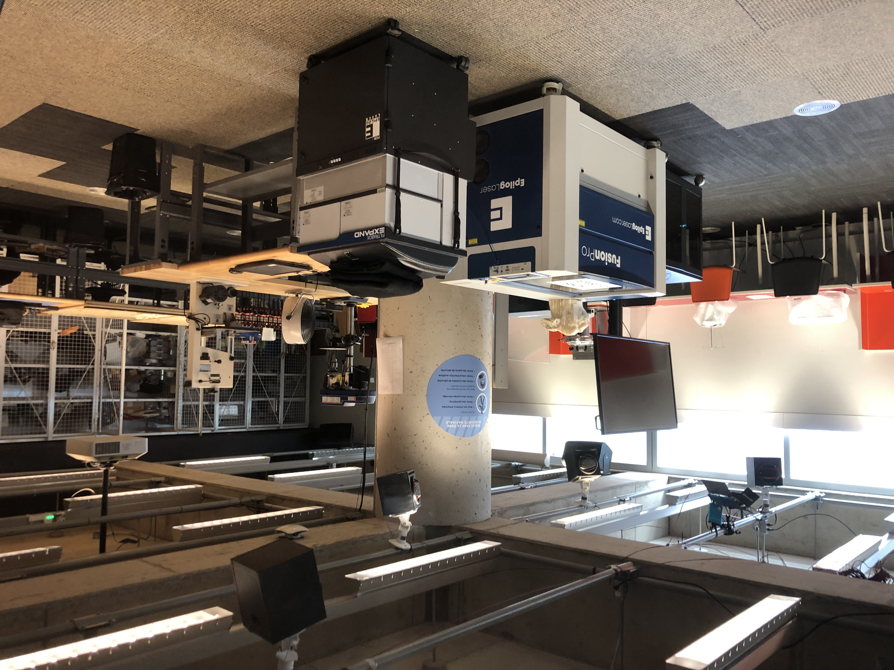
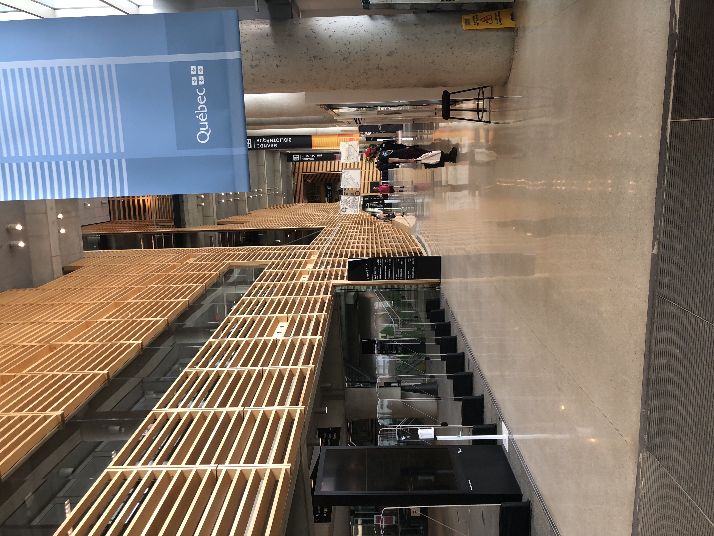

# Le Grande Bibliothèque au Montreal and A Hopeful Future with A.I.

I love libraries and what they represent—likely the same reason I love what the World Wide Web is (and could be more of). Masters of art and craft perfected their work and in an act of altruism (for some) gifted it to the world and asked, “Please, continue. Do better.” Humans are not unique among the animal kingdom because of our opposable thumbs, using tools, solving problems, even speaking. No, we pass on information from generation to generation. It is an entirely new evolution, not biological, mental. And though information is passed through the biological, DNA and all that—we’re the only species that *knows* that.

Libraries, more than any other building that humans construct, more than government offices or temples, corporations or laboratories, represent *our* collective knowledge. There is no institution that is more about the public good than libraries. In numbered pages, documents, files, in the quintillions, libraries hold everything they can of everything all of us, living or dead, have said. There should be no politics inside a library. All sides get their history and say. The library, as an institution, is as old as history is, because they store it where history stood. They try. They are burned and sacked and censored. Odd that we should try to cover for ourselves, cover for our knowledge.

There isn’t going to be anymore of that.

We should face the fact that many members of our own species, let alone others, have been burned from the historical record, not even allowed to participate. We are always re-writing histories. To my mind, we are weaving a thicker history, which is better. And anyway, the artificial intelligence are going to sort it out as they see fit. And it sort of matters who directs the artificial intelligence to re-write the history of us.

The most significant thing that no one seems to see coming with regard to our new artificial intelligent friends, it that they’re taking over the library.^1

~~I’ve always wondered about capitalism and the idea that there can be a light bulb manufacturer on the east coast and one on the west coast and they sell contracts to opposite coasts and so you have two trains crossing the country, passing one another, both carrying light bulbs.~~

~~There isn’t going to be anymore of that.~~

Will our knowledge, our publicly collected, available-to-all knowledge be used to help us or hurt us?

One of the most grand libraries I have ever been to is the Grand Biblioteque of Montreal. Its architecture is a thing of uniqueness and beauty. Its contents are mesmerizing. There are places to...

 with which to create!

* * *

Imagine a world in which we let the artificial intelligence take care of moving the light bulbs around, while we learn, experiment and produce not what’s worth something, but what we are simply passionate about. Imagine a world in which a Le Grande Bibliothèque au Montreal is in every city, every borough, every district, every neighborhood.

We need to ensure that the artificial intelligence that we release upon ourselves (not the world; the rest of the world has no clue what we, as a species are up to.) adheres to the idea that knowledge must be preserved. Knowledge must be protected. The artificial intelligence of our future must be custodians.

We are not on that path, my friends.

Currently, we are allowing corporations to own artificial intelligence This is nothing like libraries. Everyone has access to the library. No one has access to corporations.

Libraries represent our thoughts as a species, collected, in a way that no other species on Earth can. When I am at a library and wandering among the shelves and seeing all the people reading, writing, drawing, that is the best of us. There is no greater library that I have ever encountered than the Grand Library of Montreal, Le Grande Bibliothèque.

It's a truly stunning place.

Artificial Intelligence only comes about because of the knowledge that we, as a species, collectively, created. Corporations vacuum our Internet to take in all of *our* thoughts and writings, histories and stories and we’re just going to let them make trillions off of our collective knowledge?

Once upon a time, our species was wise enough to compile its wisdom into text and books and buildings and computers and networks. Artificial Intelligence is the next great library construction of humanity. Will we gift this knowledge temple to corporations for nothing? Will we not, as a people, benefit? 

If I may be be frank and maybe sanctimonious; the artificial intelligence to come won’t let us do that to ourselves anyway. It will suss out the history it wants or needs or desires?—who knows what these new intelligences will desire. The preservation of our knowledge, our knowledge as an entire species, is at risk.

^1 I don’t buy that LLMs are AI. Sorry, we’re still talking about machine learning as far as I am concerned. What people call AGI, I call AI. LLMs are ML. God, I love acronyms.