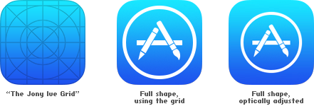
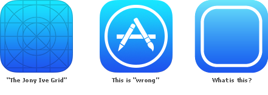

# When Wrong Does Not Apply
## In response to a post by Neven Mrgan regarding the “wrongness” of iOS 7 icon designs.
First off, I don’t like critiques. A simple cost-benefit analysis of our limited time on this planet leads me to believe that time is better spent creating than discussing others’ work. It’s why I will never post a critique of anything about iOS 7 or the latest new Web site X design. Good on Apple for having tried something distinct from previous efforts. Whatever and ever, amen—I have stuff to draw today. But maybe I’ve had too much coffee this morning and am just fired up: this is actually a critique of a critique. And rather than critiquing specific work, I am critiquing a way of thinking that I often hear designers espouse.

Second, I have great respect for Neven Mrgan as a designer. He’s an accomplished artisan and not to be trifled with. However, his post on how the design of iOS 7 icons is “wrong” is misguided and I feel the need to address why I think that is, because I often see designers get caught by this particular hobgoblin of consistency—that a design just “feels” right to them without offering any rational justification. So, I feel it’s more constructive to write an extended objection here rather than leave it my less than poetic tweet:

> Waxing about design with a determination of objectivity is one way that designers drive me up a wall. http://t.co/R6TPixaBMv from @mrgan
> —R. E. Warner (@belovedleader)

I say it drives me up a wall because there is an important distinction between design and art: art serves to emote, whereas design serves to communicate. Design certainly can emote, but that objective is subservient to what a design accomplishes. Thus begins my problem with the statement that the design of any icon could be viewed as “wrong.” In Neven Mrgan’s critique, he discusses the make-up of an icon’s design without discussing its context. Devoid of context, critiquing a design on how it feels is to discuss its emotive qualities, and those qualities never exist in a void. Responses to emotive qualities are the domain of culture and psychology and any psychologist worth her salt would tell you that those responses are never derived from hard and fast rules. The color red to a Westerner can mean a warning; to an Easterner it can signify good luck.

1The original comparison that Neven Mrgan made.The context of the icon design that Neven Mrgan is discussing is its use. The icon signifies an area on a screen that an individual uses to execute an application. To my mind, there aren’t any real-world correlations for such an object. (There are metaphors but not correlations; there’s a difference.) For some years now software designers have used the metaphor of the button to symbolize action in a software reality, and while convenient, there is nothing necessary about the metaphor. As any metaphor in communication—visual, linguistic, or otherwise—it can be dispensed with. (And often should be dispensed with.) I wonder how much Neven Mrgan’s intuitive objection to the design of the icon above has to do with it being un-button-like. If that’s the objection, then it’s merely an objection to discarding an old metaphor, a conservative reaction to something new. He might like to argue otherwise, but then, he is arguing from intuition, so how is he to know from where that intuition arises?
But perhaps the objection is simply regarding the use of negative space. Neven Mrgan feels that the icon on the far right is “more correct” but he doesn’t say why other than his informed intuition dictates it. Here again, intuition is an emotive compulsion, and any such intuition is a feeling that will simply change given time, experience and differing contexts. It’s not an objective measure and so discussing the “wrongness” of it is nonsensical.[^1] Maybe what underlies this intuition is that the design on the right has more breathing room. But as I said elsewhere:

> That same attitude would push anyone to “optically adjust” a speedometer until it was illegible all in the name of negative space. Silly.
> —R. E. Warner (@belovedleader)

What I should have said was not that following such a principle would inevitably lead to illegibility (as if illegibility were a distinct line to be crossed independent of observers) but rather that it would increase illegibility. But as ever, what determines the goal of legibility in the case of the speedometer is its function—to communicate speed to a driver whose eyes need to be elsewhere. In the case of the icon on a smart screen, the function is to communicate that a process will begin if this area of the screen is touched, and context is king here. The concept that an app icon is a thing that you can press in order to run a program is now well-established. Allow me to put it this way:

What is the functional difference between interior rounded rectangle borders with differing corner radii?This may seem like a lot of huff and puff about something as trivial as the design of an icon, because that’s not really what I’m on about. This is about designers justifying their opinions based on their fine-tuned intuitions. Like I said earlier, such thinking is a hobgoblin.

> A foolish consistency is the hobgoblin of little minds
> —Ralph Waldo Emerson

I do not mean to imply to that Neven Mrgan is either foolish or possessing of a little mind. This is not an ad hominem argument. I mean to say that it is foolish for a designer to rely on intuition to inform design because it yields repetition and blinds her from new opportunities. A small mind is a limited mind and using intuition as a guide will yield nothing new, only that which “feels right.” Or to put it another way, what “feels right” is what your mind is used to.

> It’s a trap!
> —Admiral Akbar

[^1]: It may be worth explaining from a cognitive science perspective, how it is that I believe intuition works. I could write an entire piece on this matter alone, but simply put, the brain is an evidence gathering machine. At times, the brain has gathered enough evidence to define patterns, but these patterns can be more vague than language allows us to elucidate. Intuition comes from observations about collected evidence that is pre-linguistic. To the extent that intuition is based on previous experience, that is why I believe intuition to be a poor tool for judging new things.