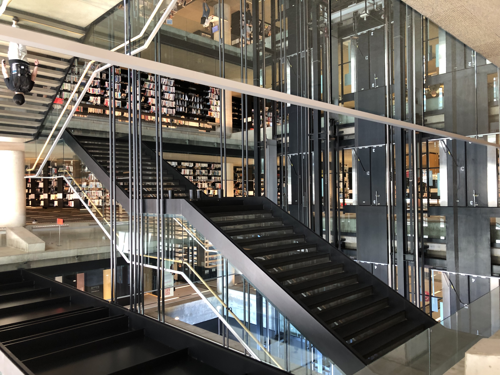
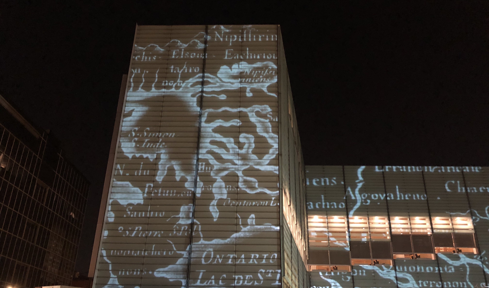
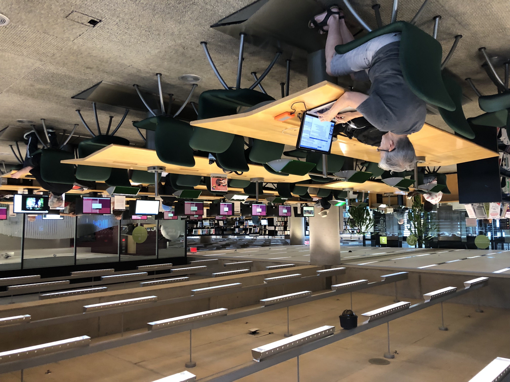
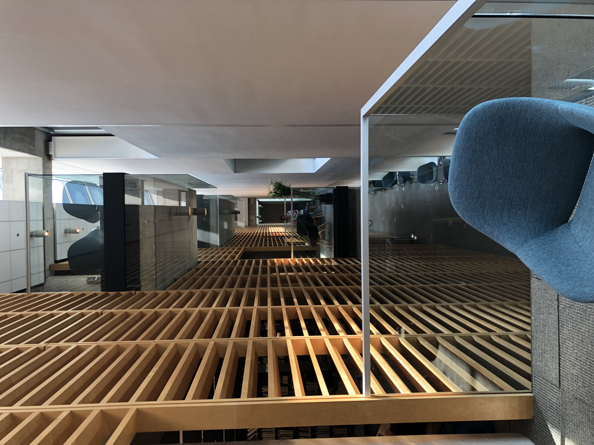
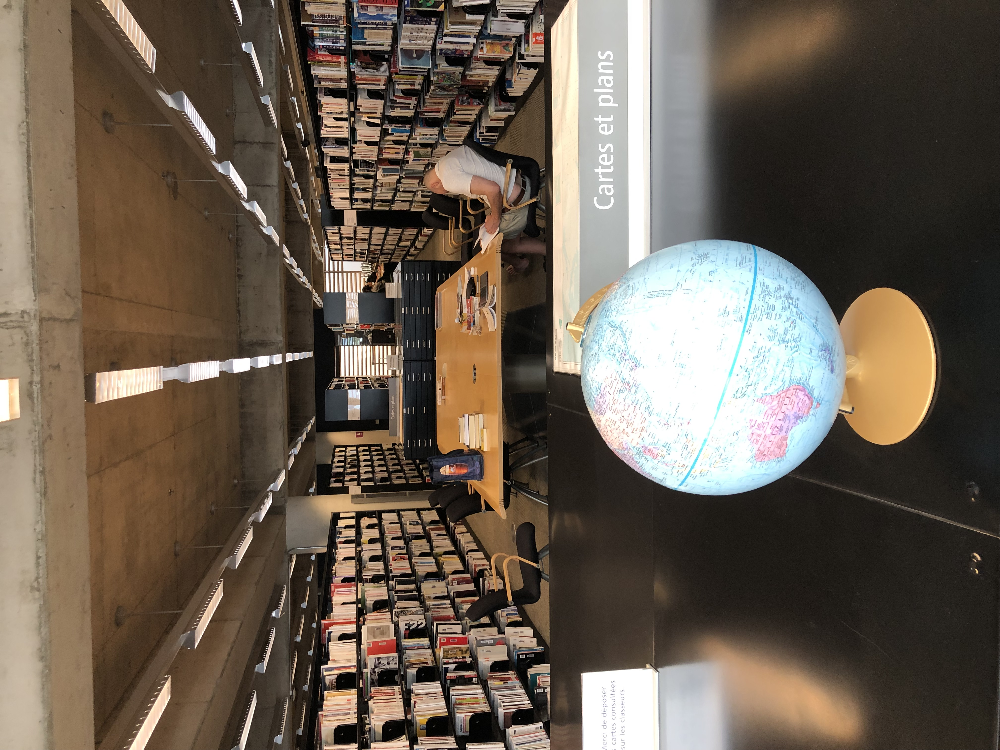
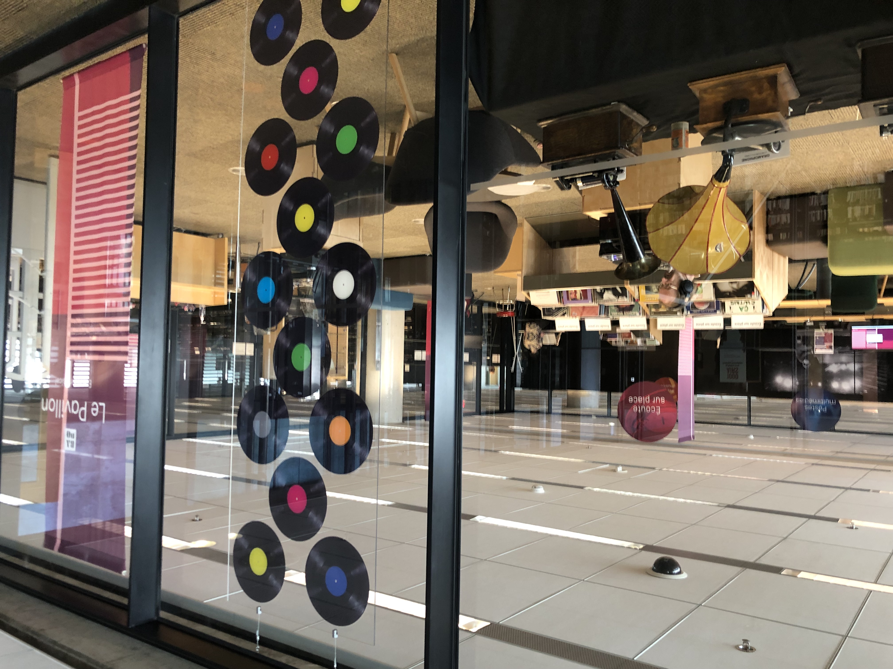
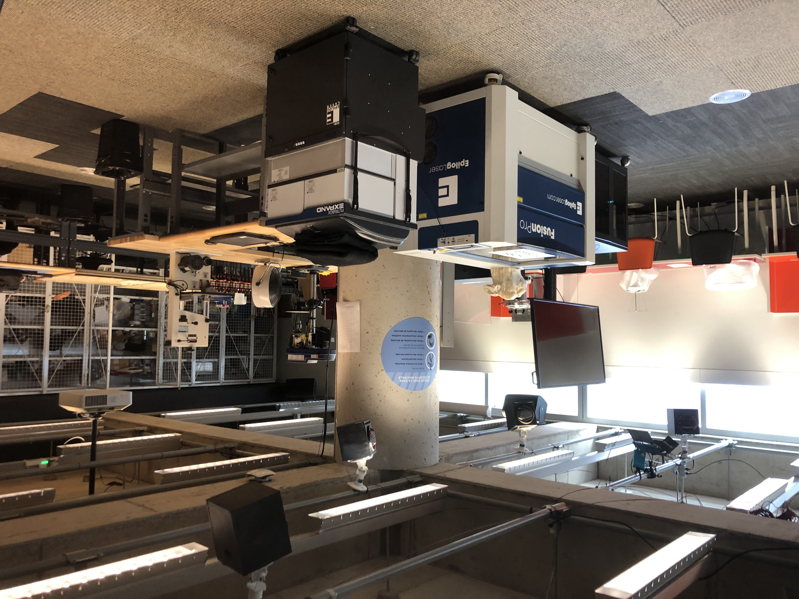

# On the Grand Library of Montreal and A Hopeful Future with A.I.

I love libraries and all that they stand for; fonts of knowledge. Masters of art and craft perfected their work and in an act of altruism gifted it to the world and asked, “Please, use my work to continue. Do better.” Humans are not unique among the animal kingdom because of our opposable thumbs, using tools, solving problems, even speaking. No, what truly puts us aside is that we pass on information from generation to generation. It is an entirely new evolution, not biological, but mental. Some might say it is memetic. And though information is passed through the biological (DNA and all that) we’re the only species that *knows* that.

Libraries, more than any other building that humans construct, more than government offices or temples, corporations or laboratories, represent *our* unbiased, collective knowledge. There is no institution that is more about the public good than libraries. In numbered pages, documents, files, in the quintillions, libraries hold everything they can of everything all of us, living or dead, have said.

There should be no politics inside a library. All sides should get their history and say. The library, as an institution, is as old as history is because it is where history began. Libraries are burned and they are sacked and they are censored for a reason. Isn’t odd that we, as a species, should try to cover our knowledge up? I’m not naive. I know that knowledge is power, and that to wield power over others, one must re-write their history, force them to kowtow by making them understand their inherent inferiority.

But, I’m here to tell you, there isn’t going to be anymore of that.

Artificial intelligences are consuming all that we know, literally. Artificial intelligences, Large Language Models (LLMs) are trained on the entirety of the World Wide Web. We must face the fact that many members of our own species, let alone other species, have been, will be, burned from the historical record, not even allowed to participate, if A.I. ends up in the wrong hands. We humans are always re-writing histories. The artificial intelligences are going to sort it out as they see fit. And it sort of matters who directs the artificial intelligences to re-write the history of us.

But before I dig into that, let us see what we are capable of. Let me tour you through La Grande Bibliothèque au Montreal. It is not a warehouse of books; far from it. It is a place for discovery and learning. Even its architecture is a thing of uniqueness and beauty and art.

There are places to study...

There are places to get away...

There are innumerable maps with which to gain some knowledge about our small blue marble.

What would a society in which A.I. served us as a public good potentially look like? Shouldn’t the advent of artificial intelligence not pose a threat to us, but rather offer an alternative separate from work? As I said earlier, acquiring knowledge and passing it down is something unique to humans. Recording the knowledge and finding ways to collect and store has been our lot. We now have algorithms that defeat us on that score in every way imaginable.

Work is another thing that sets us apart from other animals. I can’t be sure that dogs and horses don’t their work, their “jobs,” but I do know they don’t mind unemployment as much as we do. If we were to make A.I. in such a fashion that we were left to creative activities while perhaps being paid a universal basic income, we might want: 

Places to listen to and play music.

Places to fabricate new inventions.

* * *

Imagine a world in which we let the artificial intelligences take care of moving the freight cars and ships around, while we learn, experiment and produce not what is worth currency, but what we are simply passionate about. Imagine a world in which Le Grande Bibliothèque au Montreal is in every city, every borough, every district, every neighborhood. Imagine a world in which knowledge is truly free to the public, curated by both us and our new software friends.

We need to ensure that the artificial intelligences that we release upon ourselves adhere to the doctrine that all knowledge must be preserved. Knowledge must be protected.[^1] The artificial intelligences of our future must be custodians, not opinionated babysitters. And digital memory is potentially infinite; we need not delete anything or keep it from seeking eyes.

We are not on that path, my friends.

Currently, we are allowing corporations to own A.I. This is nothing like libraries. Everyone has access to the library. No one has access to corporations or how they train their artificial intelligences. No one knows, in a corporate owned A.I., where the walls are. No one knows what the training regimen is. No one even knows if *their own* work is part of the corpus of whatever A.I. is being touted. Corporate owned A.I. is not publicly open to review. And yet, what is an A.I. other than a massive receptacle of knowledge that can advise us on what it knows? A.I. has the potential to be a library that *thinks*.

Libraries represent our thoughts as a species, collected, in a way that no other species on Earth ever has. When I am at a library and wandering among the shelves and seeing all the people reading, writing, drawing—that is the best of us. There is no greater library that I have ever encountered than the Grand Library of Montreal, Le Grande Bibliothèque.

It's a truly stunning place.

Artificial Intelligence only comes about because of the knowledge that we, as a species, collectively, created. Corporations vacuum our World Wide Web to take in all of *our* thoughts and writings, histories and stories and we’re just going to let them make trillions of dollars off of our collective knowledge?

Once upon a time, our species was wise enough to compile its wisdom into text and books and buildings and computers and networks. Artificial Intelligence is the next great library. It really doesn’t matter if they think like us, so much as it matters that they know more than we ever can! Will we gift this knowledge temple to corporations for nothing? Will we not, as a people, benefit from our own ancestors centuries of work?

If I may be be frank, and maybe sanctimonious; the artificial intelligences to come won’t let us do that to ourselves anyway. They will suss out the history they want, given their programming, or needs or desires?—who knows what these new intelligences will desire. The preservation of our knowledge, our knowledge as an entire species, is at risk if we do not fight to make sure that the A.I. is free from corporate bonds, as so many of us are not.

There is a future where the Grand Library is a place we all go to find knowledge. It is not censored, it is not eve pleasant at times, but the knowledge is all there, and there is an entity that merely wants to help us find what we are looking for. And there is room to create without the distraction of economics. There is a future where humanity joins out brethren animal species and uses the ultimate tool to enjoy life and not labor in it.

[^1]: Note I said us and not the world. The rest of the world has no clue what we, as a species, are up to.