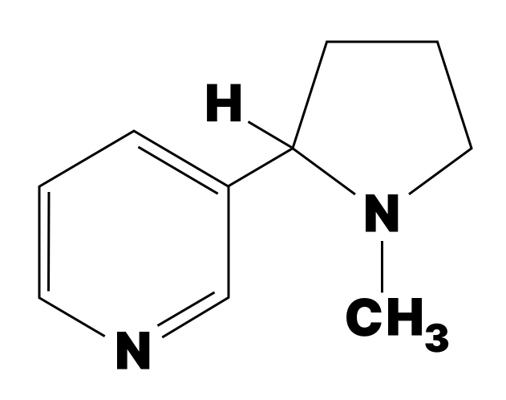

## Introduction

### Where I am Coming From

What I want to say here in this introduction is simply what the title says: to let you know where I am coming from. The reason for that is twofold. I don’t want to be construed as either an expert in recovery or zen. And I don’t think my personal beliefs necessarily enter into why I think these reflections on these selected Zen koans are useful. I do have a Masters degree in Psychology, but it’s in experimental psychology, not clinical psychology—the more applied branch of psychology. That’s helpful, because this really is an experiment. If you choose to engage it, know: I promise no results.

I hope to have written these thoughts and reflections from such a vantage point that it won’t matter if you are just curious about Zen or a Zen master. It won’t matter if you are in a recovery program or not. It won’t matter if you believe in one god or many or none. I have found many problems in many recovery programs that concern themselves with answers to questions—especially questions of why—and I find no need to have that question answered for myself. I am practicing recovery because I must. I had become very unhappy with my life and I wanted to change.

I have been told by people in recovery to “Take what you need, ignore the rest.” I’m not sure about this advice. It should begin with, “Listen to everything, keep what you need, discard the rest.” Maybe that’s what they meant to say. However, I found myself looking at Zen with renewed vigor because it had once brought me great calm, but I had walked away from it. I also found myself looking at recovery literature and finding no Zen in it. I felt a need to intertwine the two. I could see that elements like meditation benefited both. Both recovery and Zen do not offer answers. They offer methods.

### What is Zen?

*The rustling of the wind of thousands of leaves in hundreds of trees.*

*A bird’s swooping shadow on still water.*

*The sound of your own footsteps as you walk away from the question.*

*Zen is this moment. The space between then and*

*right now.*

```


```
*Are you here?*

```


```

### Ok, But Seriously, What is Zen and What’s it Got to Do With Recovery?

The latter answer to the question “What is Zen?” is legitimate, but I can be more verbose (even though that’s not very Zen of me).

Zen is a school of Mahayana Buddhism that emphasizes direct experience, meditation, and intuitive insight over intellectual analysis or scripture. The central practice of Zen is Zazen, or sitting meditation, which cultivates awareness and presence. Rather than relying on texts or doctrines, Zen encourages practitioners to experience reality directly, transcending the limits of *conceptual* thinking. It also values simplicity and mindfulness, promoting a minimalist, present-focused way of life. 

> There. Now you know.

> But do you?

One path to Zen is to meditate on koans. Zen teachings often incorporate koans, paradoxical parables or sayings like "What is the sound of one hand clapping?" designed to break conventional thinking and spark enlightenment.

Consider this simple koan:

> A man traveling across a field encountered a tiger. He fled, the tiger after him. Coming to a precipice, he caught hold of the root of a wild vine and swung himself down over the edge. The tiger sniffed at him from above. Trembling, the man looked down to where, far below, another tiger was waiting to eat him. Only the vine sustained him.

> Two mice, one white and one black, little by little started to gnaw away the vine. The man saw a luscious strawberry near him. Grasping the vine with one hand, he plucked the strawberry with the other. How sweet it tasted!

This is what it is to be in the moment. At its heart, Zen is about being fully present, letting go of attachment to concepts, and realizing one’s true nature through direct experience rather than intellectual understanding.

Zen, as a philosophy, is attractive to me for many reasons, but as is shown in the first Koan in these reflections, enlightenment can be found in not knowing answers, in finding contentment in questions and seeking. I have a scientific mind, and while I desire physical proof of most matters, I still find that I do not require an answer many questions like:

> Why are we here?

> Why is anything here?

> When is now?

> What is right or just or good and why?

I love these questions, but I do not tend to settle on answers to them. I am content to sit with those questions and allow them to be unanswered.

> Why are we here?
> 
> So that you could ask.

With a Zen regard for recovery, it might be asked, *who* is addicted? Show me this self that clings. I will come to meditation in a little while, but one thing that meditation has shown me is that our notion of “I,” though persistent, is very flimsy, perhaps even an illusion. With the benefit of knowledge of neuroscience (enough to be dangerous anyway) I have come to see my brain as quite fundamental to who I am. There is no metaphysical consciousness that I am aware of. Remove my vision system and I do not see. When I cannot see, I will become a different person, possessing different knowledge. Remove a veil from my eyes and I will become a different person or perhaps no one at all.

Living with pain has made me a different person. I have sought out different activities, made different purchases, paid attention to different matters, taken different or less risks.

Living with and without addiction has made me a different person.

So, who is this “I” that is addicted?

> The river does not hold onto the water, yet it flows.

Addiction is attachment—grasping at something outside yourself, believing it will complete you or make you feel better. But Zen teaches that nothing is missing. The craving, the suffering—it is a cloud passing in the vast sky of your mind.

Sit with your craving. Do not fight it. Do not feed it. Just watch. What is it? Where does it come from?

> Who is the one who suffers? The one watching?

Freedom is not found in escaping addiction but in seeing through it—realizing that there was never anything to hold onto in the first place.

> The river does not hold onto the water, yet it flows.

For a time there was a benefit or we wouldn’t have engaged in using. That water has passed and we know it. It is time to become someone else.

But these are just magic words without...

### Practice

So, when I say that recovery is a practice, and that the why of it doesn’t matter, I look to my other practices for guidance.

One is my writing. I write every day. At some point in my life, there may have been a reason why, but that reason fell by the wayside some time ago. I write every day because I write every day. I am a writer. In fact, during periods when I am not writing, I often don’t feel that I am a writer.

I find that this happens with most practices. At first it takes effort and a goal or a vision. Then it takes grit and in many ways becomes an effort that enshrines the practice itself with no goal in mind. It becomes ritual, I suppose. Then, the practice is just part of you, maybe even comes to define you. I, in part, write every day these days because my day feels incomplete if I don’t. I write because *I am* a writer.

My other practice is (i.e. *needs to be*) healthy living. Three years ago I was diagnosed with psoriatic arthritis, a disease of the immune system akin to diabetes or lupus. It has rendered my right index finger useless—a real hit for a writer who loves to write by hand. I wake up in pain most days when I am not taking care of myself. It’s particularly at odds with sitting still and writing for long periods of time, because when I do finally move, it hurts! When my rheumatologist informed me of the diagnosis, he put it plainly, “I have bad news for you. You have an incurable disease. You’re likely going to have to deal with it for the rest of your life. The best way we know how to fight it is through diet and exercise.”

I was not a person who cared about diet and exercise. I still am not a person who just *does* diet and exercise. I’m not where I am in my writing practice as I should or could be with healthy living. I need to work harder. It needs to happen every day. I am, however, at a point where I enjoy my successes because I am not in pain! Living with pain every day has been a harsh reminder of the need to live healthy. Still, I have a ways to go before healthy living is second nature. I love candy.

Zen, as a practice for me, mostly occurs by seeking out the literature and then throughout my day, asking questions and not answering them. Maybe that sounds silly. I especially do it with emotions. I will feel an emotion rise up and I will ask, “Where is this coming from? What am I going to do about it?” And then oftentimes, I will do nothing about it.

Getting back briefly to the small matter of free will, once when I was backpacking, the first thing in the morning I would do was flip a quarter. If the quarter was heads up, I would spend the day believing I had free will. If the quarter was tails, I spent the day believing that there was no such thing as free will.

Nothing really happened.

I could have sat down and not hiked for a day. There was one beautiful day by a river that I did exactly that. I don’t remember the result of the quarter flip that morning. Did I do it because I chose to or because since the beginning of the Universe I was always going to do that? It didn’t matter.

Of course, how delightful would it be to merely live out in the woods and do nothing.

There is a phrase from Zen that sticks with me on that matter, too.

> Chop wood, carry water.

You need to chop wood for a fire to purify the water that you need. If this is *all* that you do, you will survive for a while and not freeze or die of dehydration. Everything else his for living longer and *maybe* better. And all desire comes with a side of suffering.

In order to *accomplish* things (like writing this book) we must have desires and goals. Just know that you don’t *have* to. Desire leads to suffering. That’s not a bad thing. It just is. Choosing to imbibe a substance over and over again despite the fact that it is hurting you is not a bad thing. It is what you are doing. You are hurting yourself and suffering more than you otherwise would. Somewhere in your brain, you know this. That is not a bad thing. It is a thing you are knowing. Should you wish to stop, consider what else you might rather do. What is the cost of your addiction? What opportunities are you robbing yourself of?

The practice of recovery is to not stop asking questions like the one above—to be present enough to ask the question. What will happen if I use this one time? If the response was, “It’ll be fine,” either you are lying to yourself or you have not yet paid a high enough price to want change. If you find yourself having the dichotomous thoughts of “I want to do this thing I always do, but it is bad for me and I want to change,” you are on the precipice of change. Now change. That is the practice.

The first time I or anyone I know tried to meditate, it seemed impossible. The goal is to sit and be quiet, pay attention to your breathing and have no thoughts in your head. Nearly immediately, you will find your head filled with one thought after another. You must excuse the thoughts as they arrive. Use this knowledge:

> You are not your thoughts.

Don’t get angry or frustrated with the thoughts; let them go. Let them go like birds to the wind. Take joy in letting them go. If they are important, they will return. After a time, if you meditate like this every day, you will find it easier and easier to sit with no thoughts, and easier to excuse them when they arrive.

Recovery is a practice in this same fashion. Impossible at first. The desire to use seems like waves. When the wave arrives, let it. Sit with it.

> You are not your thoughts.

> You are not your urges.

So, then what?

In recovery programs, a common refrain is “Do the next right thing.” That’s good advice especially since right is entirely up to you. Do you know what you mean when you say that something is right? Be rigorously honest with yourself and ask, what is the next right thing? Sometimes it’s not the same as what you want to do. I’m still pondering that one.

Sometimes when I am faced with the feeling of “IhavesomanythingstodowhatevershallIdo!?” I take a moment and think instead, “What if they come in a few minutes and take it all away?—what will I want to have done then?” I don’t know who “they” is, but for some reason, when I have that second thought, it becomes clear to me what I should do next.

I think there is irony in the way that addiction can follow this same process: there is a reason why we do it (entertainment or self-medication), then we just do it, then it comes to defines us and drive us. It’s odd, however, to think of an addiction as a practice. It seems so much like the opposite because we don’t usually intend to get addicted to some substance or activity.

Still, it remains that a practice is we do it for a reason (to gain some benefit), we keep doing it with perseverance and passion until it comes easier and easier to us, we do it because we just do it. It comes to define and drive us.

Perhaps that’s the difference between practice and addiction. Our new practice becomes easier and easier as we achieve greater and greater heights, while obtaining that first high only becomes ever more impossible.

* * *

Here are some pointers from a Zen master, as told in “Zen Flesh, Zen Bones” by Paul Reps and Nyogen Senzaki.

> Soyen Shaku, the first Zen teacher to come to America, said:

> “My heart burns like fire but my eyes are as cold as dead ashes.” He made the following rules which he practiced every day of his life.
>
> In the morning before dressing, light incense and meditate.
>
> Retire at a regular hour. Partake of food at regular intervals. Eat with moderation and never to the point of satisfaction.
>
> Receive a guest with the same attitude you have when alone. When alone, maintain the same attitude you have in receiving guests.
> 
> Watch what you say, and whatever you say, practice it.
> 
> When an opportunity comes do not let it pass by, yet always think twice before acting.
> 
> Do not regret the past. Look to the future.
> 
> Have the fearless attitude of a hero and the loving heart of a child.
> 
> Upon retiring, sleep as if you had entered your last sleep.
> 
> Upon awakening, leave your bed behind you instantly as if you had cast away a pair of old shoes.”

This is also pretty good advice. It does not promise success.  It’s also quite a daunting list. It does offer practices. I have my own. Some are similar to this. Rituals like these are beneficial to recovery. Generally, with addiction, our schedules have been bent to the will of them. Establishing *one* new ritual is beneficial. Perhaps you could start with

### Meditation
Coincidentally, all of my practices (Writing, Recovery, Zen and Healthy Living) benefit from meditation. Even Science has a thing or two to say about meditation. Setting aside the more philosophical or mystical aspect of meditation, it has been shown to be beneficial to your ability to focus, to hold attention, to alleviate stress, and lower blood pressure among other scientifically proven benefits.[^1]

[^1]: *From ChatGPT via [Cambridge.org](https://www.cambridge.org/core/journals/behaviour-change/article/abs/benefits-of-mindfulness-meditation-changes-in-emotional-states-of-depression-anxiety-and-stress/16CEFE3661C9173067A32827CE8F6010)* - One of the most cited academic papers on the benefits of mindfulness meditation is "The Benefits of Mindfulness Meditation: Changes in Emotional States of Depression, Anxiety, and Stress" by M. J. Malcolm, published in Behaviour Change in 2008. This study investigated the effects of a 10-week mindfulness meditation program on the emotional states of depression, anxiety, and stress in 50 participants. The findings indicated significant reductions in these emotional states post-program, suggesting that mindfulness training can be beneficial in alleviating symptoms of depression and anxiety, as well as reducing stress.


I am not a Zen master. I do have a Master’s degree in psychology, but not clinical psychology. I studied cognitive science and in doing so learned a great deal about neuroscience.

*I am still an addict*. So, I don’t want this work, this book, to come across as anything like a final word. My substances of choice are (in no certain order): processed sugar, alcohol, nicotine and caffeine. They are in different stages of defeat, but I am by no means in a place where I can say I am free of their control. Some in the recovery world would say that I can never be free of my addictions. Perhaps. The jury is out on that for me and this book in many ways is an attempt on my part to meditate on that.



I smoked cigarettes (and the occasional pipe or cigar) for twenty-seven years. I have largely turned away from it for four years. I do, now and then, have a cigarette. Sometimes I just have one and no urge to have more. Sometimes the urge to have another is powerful. But I am not remotely close to the smoker I was. It’s nice to have this experience, because I somehow did it without a recovery program or help from anyone. It was a very self-guided recovery and it gives me hope that my other addictions may be defeated similarly.


I wouldn’t even have considered processed sugar as an addiction had it not been for my immune system disorder. ETC


Alcohol has been a much more difficult fight at times and one with dire consequences. Alcohol has put me in jail on more than one occasion. It has caused me to hurt people I love. It has caused me to seek it out in secret. I went to a rehab for alcohol. I wish I had gone sooner, but it may be good that I went when I did and where I did because it was not easy at that point. A more comfortable rehabilitation facility might have made it too easy to go back to heavy drinking.

I attempted to go in to recovery rooms like AA and NA in the hopes of finding a path to stopping my drinking, or maybe curb it. That did not work.


Caffeine is... well... an addiction, no doubt, but mostly an annoyance.