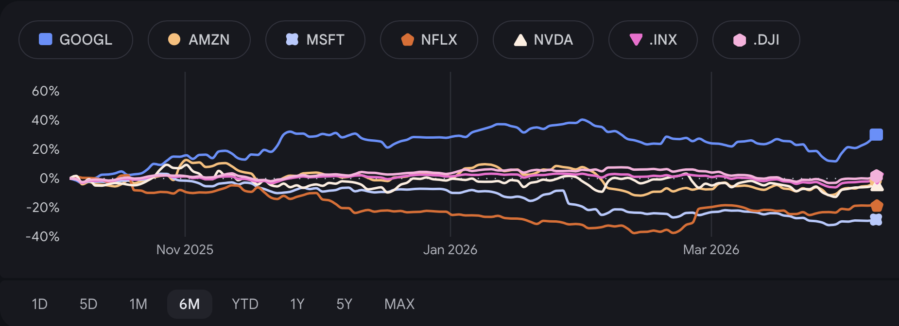
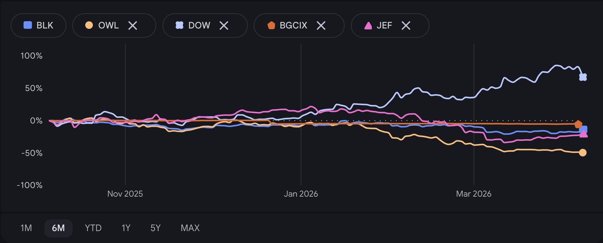

# US Tech Sector Investment Outlook

## Three Pressure fronts on the Tech Sector (6-8 months)
1. Petroleum Derivatives
2. Private Equity Firms
3. AI Infrastructure versus AI Clients

### 1. Energy  

1.1. Non-independent Electronic Manufacturing
:    The US is fairly energy independent; however, we do not manufacture many of the components that go into electronics devices.  

1.2. Derivative products
:    Inert gases (helium, neon, xenon) plastics, polymers, epoxy resins are used in the manufacture of electronics components and chips, but are manufactured in Asian countries that are already feeling oil price pressures. These price increases will be passed on to US tech companies.

### 2. Private Equity (PE)

2.1. Private Equity Firms Difficulties 

2.2. Through-line from PE firms to Tech Stocks.
:   When PE funds borrow heavily, commercial rates rise to counter demand, reducing mergers and acquisitions (M&As). M&A activity in tech is a significant driver of tech stock valuations. Less PE activity = fewer acquisition bids = a lower "floor" on smaller tech valuations.

	
### 3. AI Infrastructure versus AI Clients

3.1. Unbalanced S&P
:    Indices are top-heavy with infrastructure investments rising the question if there is demand for this investment. An estimated 41% of of the S&P is invested in AI Infrastructure and not AI use.[^1]

## Sources

[^1]: "[The ‘Great Narrowing’: S&P 500 concentration](https://www.rbcwealthmanagement.com/en-us/insights/the-great-narrowing-sp-500-concentration)" — January 22, 2026

