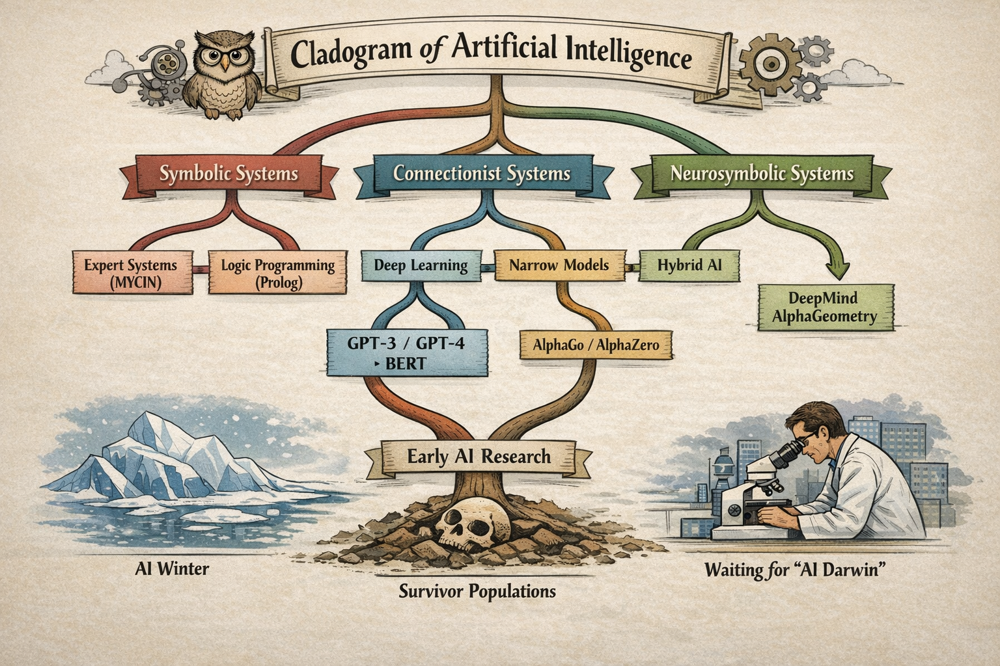

# Who Named These Animals?

In 1735, [Carl Linnaeus](https://en.wikipedia.org/wiki/Carl_Linnaeus) was twenty-eight years old and had opinions about everything. He published *Systema Naturae* — a twelve-page pamphlet, initially — and proposed that the entire natural world could be organized into a nested hierarchy of kingdoms, classes, orders, genera, and species. Every living thing had a place. Every place had a name. The name was in Latin, which meant it was universal, which meant that a botanist in Uppsala and a naturalist in Batavia were finally talking about the same plant.

It was one of the most useful intellectual acts in the history of science. It was also, in important ways, wrong. Linnaeus classified whales as fish. He put humans with the apes — *Homo sapiens* alongside *Homo troglodytes* — which caused a scandal that echoes in certain corners of the internet to this day. He had no theory of why the categories existed, only that they did. It took Darwin, a century later, to explain the *mechanism* — to show that the categories weren't natural facts but evolutionary artifacts, the residue of shared ancestry and divergent selection pressure.

We are at the Linnaeus stage in artificial intelligence. We have the pamphlet. We do not have Darwin.

---

## The Two Tribes

Modern artificial intelligence has two deep roots, and they have been at war for most of their shared history.

The first is the **symbolic** or **expert systems** tradition — the belief that intelligence is, at its core, the manipulation of symbols according to rules. You represent knowledge explicitly: *if the patient has a fever and a rash, consider these diagnoses.* You encode the rules of chess, the laws of physics, the structure of a contract. The system reasons by following the rules, and you can audit every step. [IBM's Watson](https://en.wikipedia.org/wiki/Watson_(computer)) — the system that defeated the best human *Jeopardy!* players in 2011 — is the most famous product of this tradition, though Watson is a hybrid more complex than its public image suggests. The dream of the symbolic AI researcher is a system whose reasoning is transparent, whose errors are diagnosable, and whose knowledge can be updated by editing the rules.

The second is the **connectionist** tradition — the belief that intelligence emerges from networks of simple units that learn by adjusting the strength of their connections in response to experience. You don't write the rules; you show the system examples and let it find the patterns. The architecture is inspired, loosely, by the structure of biological neurons. The dream of the connectionist researcher is a system that generalizes from examples the way humans do — seeing enough cats to recognize a cat it has never seen before.

These traditions have alternated in dominance for seventy years, each cresting and receding as funding followed promise and promise failed to fully materialize. The crashes were called [AI winters](https://en.wikipedia.org/wiki/AI_winter). They were not failures of intelligence research, exactly. They were failures of expectation management — overselling followed by disillusionment followed by defunding. The species that survived each winter were not necessarily the most capable. They were the ones whose patrons remained solvent and interested. Evolution by grant cycle is still evolution, but it selects for different traits than capability alone.

---

## The Cladogram

A [cladogram](https://en.wikipedia.org/wiki/Cladogram) is a biologist's tool — a branching diagram showing evolutionary relationships, where each fork represents a divergence from a common ancestor. If you drew one for AI, the major branches would look something like this:

The symbolic branch gives you expert systems, logic programming, knowledge graphs, and — in its most refined modern form — systems like [Wolfram Alpha](https://www.wolframalpha.com), which can actually *compute* answers rather than retrieve them. Rule-based, auditable, brittle at the edges of their rule set.

The connectionist branch gives you neural networks, deep learning, and — at its current apex — the large language models occupying most of the oxygen in contemporary AI coverage. Pattern-matching, fluent, opaque, and — as we established in the previous article — architecturally incapable of semantic understanding or genuine reasoning.

But the cladogram has branches the industry's marketing department has mostly ignored.

**Narrow connectionist models** — systems like [AlphaGo](https://en.wikipedia.org/wiki/AlphaGo) and its successor [AlphaZero](https://en.wikipedia.org/wiki/AlphaZero) — are connectionist in architecture but radically specialized in application. AlphaGo learned to play Go by playing itself, millions of times, until it developed strategies that no human had conceived. It dismantled the world's best players and then dismantled itself with a stronger version. It knows one thing — the game of Go — with a depth that no human will ever match. It cannot make you a sandwich. It doesn't know what a sandwich is. It is a hedgehog of extraordinary capability, completely uninterested in being a fox.

**Cultivated models** — a category that barely exists in mainstream AI taxonomy — are something different again. Not narrow by game rules, but narrow by *corpus*. A model trained exclusively on authenticated artworks and documented forgeries, curated by art historians and forensic specialists, trained to detect the specific micropatterns of brushstroke, pigment aging, and compositional anachronism that betray a fake — that is a different organism from a general LLM, even if the underlying architecture is similar. The difference is in what it was fed, and by whom, and with what care. A cultivated model is a hedgehog by deliberate design. The industry ignores it because you cannot pitch it to a general audience, and the general audience is where the money is.

**Neurosymbolic systems** — hybrids that combine connectionist pattern recognition with symbolic reasoning — represent the most intellectually serious current attempt to build something that actually thinks, rather than something that convincingly sounds like it does. [DeepMind's AlphaGeometry](https://deepmind.google/discover/blog/alphageometry-an-olympiad-level-ai-system-for-geometry/) solved problems at the International Mathematical Olympiad level by pairing a neural model with a symbolic geometry engine — the neural component proposing candidate constructions, the symbolic component verifying their validity. Neither component alone could do what the combination achieved. This is not a philosophical position. It is an existence proof.

---

## The Survivor Populations

To understand where AI is going, it helps to understand what the AI winters actually killed — and what they didn't.

The first winter, in the 1970s, killed the most ambitious symbolic AI programs — the ones that promised general reasoning and couldn't deliver. What survived: narrower, more domain-specific expert systems that made honest promises about limited domains. Medical diagnosis. Oil exploration. Financial analysis. These worked, within their limits, and they continued to work quietly in industrial applications throughout the connectionist revival.

The second winter, in the late 1980s and early 1990s, killed the first wave of commercial expert systems — which had overclaimed and underdelivered, predictably — and nearly killed the connectionist research programs too. What survived: fundamental research groups with patient institutional backing and the specific subfields that found industrial applications quickly enough to remain funded. [Yann LeCun's](https://en.wikipedia.org/wiki/Yann_LeCun) convolutional neural networks for handwriting recognition, running in bank check-processing systems, kept the light on for a decade.

The current AI summer — warm since roughly 2012, torrid since 2022 — will also end. It always does. The question is what survives. The symbolic tradition has never died; it has been biding its time in industrial control systems, formal verification, and computational mathematics. The narrow connectionist specialists — AlphaGo's descendants — are doing things with protein folding and materials science that will outlast any investment thesis. The cultivated models, if anyone bothers to build them properly, will find their niches. The general LLMs will survive as tools, commoditized and useful, shorn of their AGI pretensions.

What won't survive — what has never survived — is the claim that this time, finally, we have the thing that thinks. Every generation has made that claim. Every generation has been wrong. The next generation inherits whatever the previous one actually built, which turns out to be more useful and less transformative than advertised.

This is not pessimism. It is paleontology.

---

## The Darwin We're Still Waiting For

Linnaeus gave us the categories. Darwin gave us the mechanism — natural selection as the explanation for why the categories exist and how they change. We have Linnaeus for AI. We are still waiting for Darwin.

The Darwin of AI will explain not just what these systems are, but what selective pressures produced them, how they relate to each other through shared ancestry, and — most usefully — which lineages have viable futures and which are evolutionary dead ends being kept on life support by investment capital. This person will probably not be working at one of the large model companies. The people at the large model companies have strong financial incentives to not see the cladogram clearly. And to be clear, this evolution stuff I’m talking about is a metaphor... right?

[Gary Marcus](https://en.wikipedia.org/wiki/Gary_Marcus), who has been making the neurosymbolic case for longer than it has been fashionable, is a candidate. [Yann LeCun](https://en.wikipedia.org/wiki/Yann_LeCun), in his more recent public statements skeptical of LLM scaling, is at least asking the right questions. The field is producing its Darwin somewhere — probably in a lab that isn't getting much press coverage, working on a problem that doesn't have an obvious short-term commercial application.

That's how Darwins tend to work.

---

*← Back: [The Fluency Illusion] — what LLMs actually are and why the valuation is a fantasy*
*← Back to The AI Diaspora hub: [The Map Is Not the Territory]*
*→ Next: [The Modular Mind] — Minsky's society, neurosymbolic AI, and the wilderness at the edge of the map*
