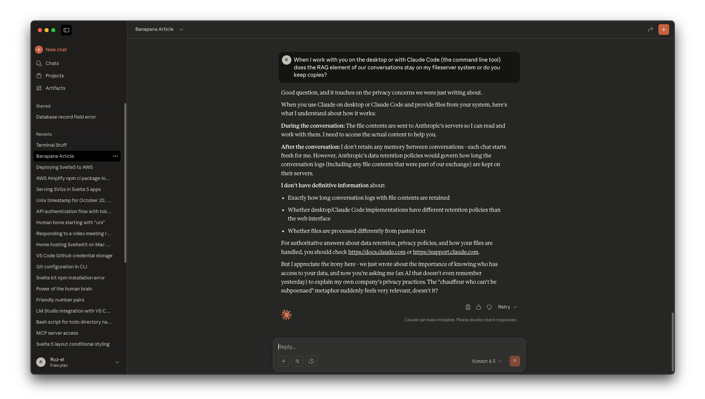
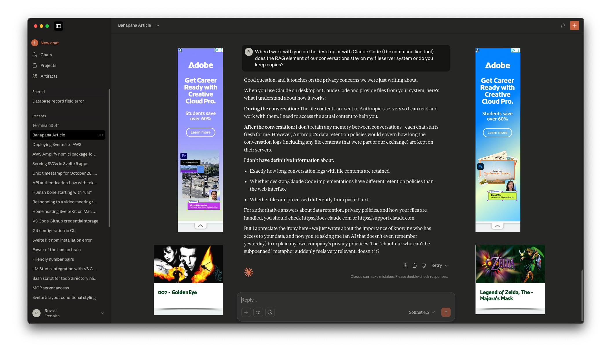
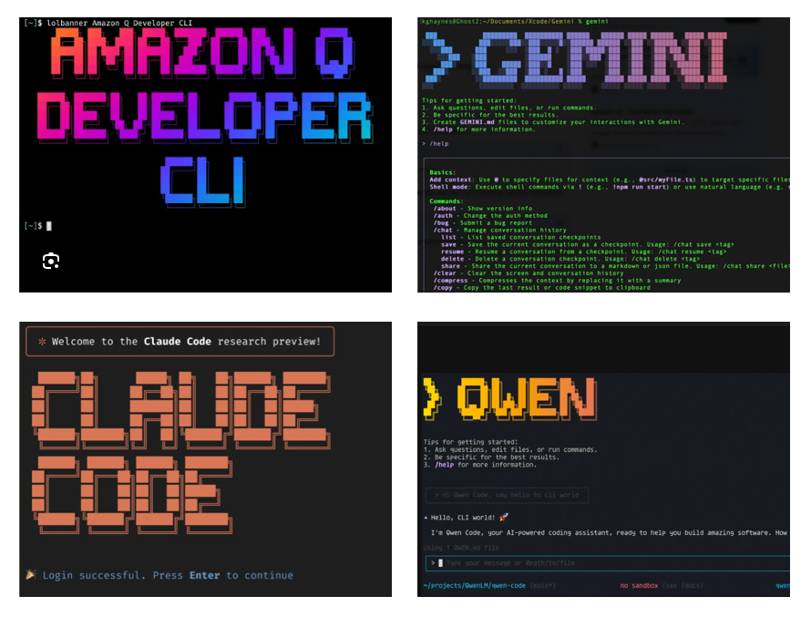

# The Harbinger

I was enjoying the relative quiet of an AI desktop app.

I realized that this is what web browsers *used* to look like and it dawned on me that this might be the future:

But the future is post-literate and post-cognitive, so this will all be speech driven. You know, oral traditions like times of olde. Which made me also ask, what's up with all the command-line interface Ai tools coming out?

The answer: they no longer want to be intermediaries. They want access to your hard drive, your files, you. Anybody else see where this is going?