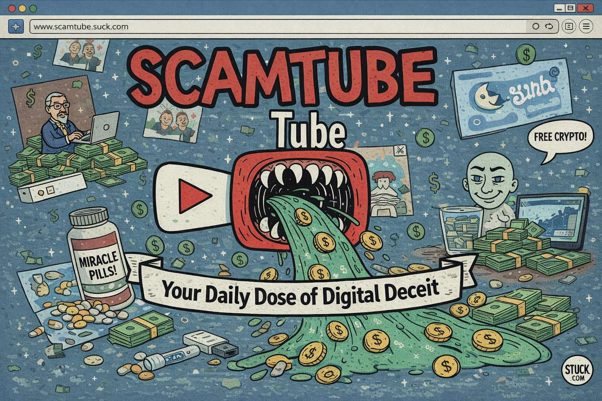

### *This is the first of a series of articles on the topic of Youtube’s newfound scuzziness.*

# Doomtubers

There's a man in Beijing with a whiteboard who knows exactly how civilization ends.

He'll tell you about it in a measured, academic tone—the kind that implies he has tenure somewhere important (he teaches at a progressive high school, but details). He'll draw arrows between historical events. He'll invoke game theory, Asimov, the Sicilian Expedition. He graduated from Yale. He's published. He has a Harvard affiliation. The whiteboard is spotless.

His name is Jiang Xueqin, he runs a YouTube channel called [Predictive History](https://www.youtube.com/@PredictiveHistory), and in May 2024 he recorded a classroom lecture predicting that Donald Trump would win the election and drag America into a catastrophic war with Iran. When those things started happening, the lecture went from a few hundred views to a hundred thousand subscribers in three days. The internet crowned him “[China's Nostradamus](https://ground.news/article/chinas-nostradamus-warns-how-us-iran-war-ends-after-predictions-come-true).” *Newsweek* wrote him up. He went viral in the most literal sense—something inert suddenly replicating everywhere.

The whiteboard did a lot of work in that lecture. It's the visual grammar of legitimate pedagogy—*this is a classroom, I am a teacher, what follows is knowledge.* Combined with the Yale credential, the measured delivery, the invocation of psychohistory (Isaac Asimov's fictional mathematical science of mass human behavior), and a framework that sounds rigorous without being falsifiable, you get something that looks indistinguishable from genuine insight. The epistemic costume is perfect.

Here's the thing: it's a costume.

# The Model That Isn't

When Jiang refers to his charts as "models," something important collapses quietly and nobody notices. A chart showing historical patterns is a visualization. It can *illustrate* a hypothesis. But a model has formal structure—parameters, math, a mechanism that generates specific predictions you can be *wrong about in advance.* Asimov's fictional psychohistory worked precisely because Hari Seldon could calculate probabilities on specific outcomes with quantified uncertainty. What Jiang does is the opposite: he uses the *aesthetic* of rigorous prediction—game theory vocabulary, historical pattern-matching, structural analysis—without the formal machinery that would make any of it testable.

Call it psychohistory cosplay.

The game theory framing has the same problem. Real game theory requires formally specifying players, available strategies, payoff functions, and information structures. When those are pinned down, you get specific equilibrium predictions you can be wrong about. But if "game theory" just means *I think about incentives narratively*, then it's not doing the predictive work—it's reasoned storytelling with prestige vocabulary stapled on.

Psychologist Philip Tetlock spent [decades running forecasting tournaments](https://www.amazon.com/Superforecasting-The-Art-Science-Prediction/dp/0804136718) with thousands of participants to figure out who actually predicts things well. His finding, borrowing Isaiah Berlin's old fox-and-hedgehog distinction: the people who know *one big thing* and organize their worldview around a grand unified theory—hedgehogs—perform barely better than chance. The people who draw on multiple frameworks, hold views with calibrated uncertainty, and update when evidence arrives—foxes—significantly outperform them.

Jiang is a hedgehog in a fox costume. The costume is very good.

# The Broken Watch Problem

When the predicted events started materializing—Trump elected, U.S.-Iran tensions escalating—the clips went everywhere. What didn't go everywhere: the ceasefire Trump brokered, which was distinctly not the "boots on the ground, hostages not soldiers" catastrophe Jiang outlined. In the comments and forums, this was smoothly reframed: the prediction was always a *thought experiment about structural forces*, not a literal forecast. The framework absorbed the contradiction without updating. This is not a bug. It is the [load-bearing feature](https://en.wikipedia.org/wiki/Falsifiability).

One Reddit commenter, admirably resistant to the zeitgeist, noted that given the sheer number of self-proclaimed geopolitical forecasters online, one of them was statistically bound to get a scenario partially right. Even a broken watch is right twice a day. The internet finds that broken watch and makes it famous, and then the watch is no longer "broken"—it's *prescient.* The watches that were wrong at the same moment are forgotten entirely.

This is not how we should be evaluating forecasters, and Tetlock would tell you so at length.

*[The Free Press](https://www.thefp.com/p/meet-the-internets-new-iran-expert-who) also noted, almost as a footnote, that Jiang believes a coalition of Freemasons, Jesuits, and members of a defunct Jewish cult are conspiring to rule the world from Jerusalem—which is either a red flag about the framework underneath, or proof that the whiteboard really is doing enormous work.)*

# Ancient Appetite, New Distribution

Here's what makes this more than a story about one YouTube channel: the appetite Jiang is feeding is ancient and remarkably stable across cultures. Every civilization generates its own eschatological framework. The Norse had Ragnarök. The Zoroastrians had Frashokereti. Christians have Revelation. We have geopolitical YouTube. The packaging changes. The demand doesn't.

Apocalyptic narratives are [paradoxically comforting](https://en.wikipedia.org/wiki/Terror_management_theory)—they impose meaning and structure on what otherwise feels like chaotic, uncontrollable events. If civilization is collapsing according to a *plan*, at least someone understands it. The alternative—that history is messy contingency with no grand arc and no hidden architect—is genuinely harder to sit with. Certainty, even catastrophic certainty, is preferable to the fox's maddening "it depends."

There's also a status dimension. Knowing about the coming catastrophe before everyone else feels like insider knowledge. You're not a passive victim of events—you're one of the few who *see.* This is the same psychological reward structure as any conspiracy theory, dressed in a blazer and standing in front of a whiteboard.

YouTube's incentive structure selects hard for exactly these qualities. Confident, vivid, high-stakes narratives get clicks. Calibrated uncertainty gets skipped. A thumbnail reading "WHY THE EMPIRE IS ABOUT TO COLLAPSE" outperforms "here are some probabilistic tendencies worth monitoring" by an order of magnitude. The platform doesn't just host doomtubers—it *breeds* them, by systematically rewarding the epistemic vices Tetlock identified and penalizing the epistemic virtues. The recommendation algorithm then clusters them together, so viewers who watch one get fed the entire ecosystem, progressively less tolerant of ambiguity.

McLuhan would have recognized this immediately: the medium doesn't just carry the content, it *selects* for it. YouTube is a hedgehog factory.

# Festinger's Prophecy

In 1956, psychologist Leon Festinger [infiltrated a UFO doomsday cult](https://www.amazon.com/When-Prophecy-Fails-Social-Psychological/dp/1578988527) in Chicago that had predicted a great flood would destroy the world on a specific date. When the date passed uneventfully, the group didn't dissolve—it intensified. They began proselytizing harder than ever. Festinger developed his theory of cognitive dissonance to explain it: the greater the investment in a belief, the more creative the mind becomes in protecting it from disconfirming evidence. The prediction failing wasn't experienced as refutation—it was reframed as confirmation that the group's faith had *saved* the world.

But here's the part worth sitting with: the prediction was almost a pretext. It provided the initial activation energy for people to find each other and form bonds. Once those bonds existed, the social reality of the group *became* the thing being defended—not the original claim. The theology was fungible. The belonging wasn't.

Festinger essentially described YouTube comment sections in 1956.

The doomtuber phenomenon has a structural wrinkle Festinger couldn't have anticipated, though: the parasocial nature of the YouTube relationship partially dampens the social cohesion. You have a one-sided relationship with the lecturer—he doesn't know you exist—which limits the depth of community that can form around the channel itself. What actually happens, in the documented cases, is a two-platform structure: YouTube as recruitment funnel, with Discord servers, Subreddits, and private forums as the layer where genuine bonding occurs. The parasocial relationship is the entry point; the peer community is what makes extraction difficult.

Stefan Molyneux's [Freedomain Radio](https://en.wikipedia.org/wiki/Stefan_Molyneux) is the clearest example of where this architecture leads when the intellectual good faith runs out entirely. YouTube channel, private forums, a framework of pseudo-therapeutic certainty, and a practice he invented called "deFOOing"—departing from one's Family of Origin—that functioned as the community's loyalty test. Multiple cult experts identified the dynamics. The British Cult Information Centre called it a cult. When the deFOOing started making international news, Molyneux's response was: "If I advised a wife to leave an abusive husband, there would not be articles about how I am a cult leader." The whiteboard equivalent of the thought experiment defense.

# The Costume Is the Message

What makes Jiang more interesting than Molyneux—and more instructive—is that he's genuinely more intellectually serious. The Yale education, the engagement with actual history and philosophy, the classroom context—those are real. He has read the books. He knows the arguments. He's not purely performing expertise; he has some.

Which is exactly what makes the epistemic costume so effective, and so worth examining. It's easy to dismiss an obvious charlatan. It's harder—and more important—to articulate why a credentialed, well-read, thoughtful person, operating in the medium of the classroom, produces the same audience dynamic as a prophet with a sandwich board. The answer isn't that Jiang is secretly a charlatan. The answer is that the platform transforms what the classroom *does.*

In an actual institution, the whiteboard comes with accountability structures: peer review, departmental colleagues, students who challenge you, an obligation to update when evidence contradicts your framework. The classroom's epistemic authority signals are meaningful because they're backed by those structures. Transplanted to YouTube, the authority signals survive intact. The accountability structures do not. You keep the whiteboard. You lose everything that made the whiteboard trustworthy.

The medium strips the accountability while preserving the aesthetic. A hundred thousand people watch a professor who answers to no one, in a classroom that never ends, teaching a subject that cannot be graded.

Festinger would recognize the room. He just wouldn't have predicted the scale.

---

*If you want to understand how the platform shapes the prophet, [Tetlock's Superforecasting](https://www.amazon.com/Superforecasting-The-Art-Science-Prediction/dp/0804136718) is where to start—and then come back and watch any doomtuber with the sound off. The whiteboard will look different.*
