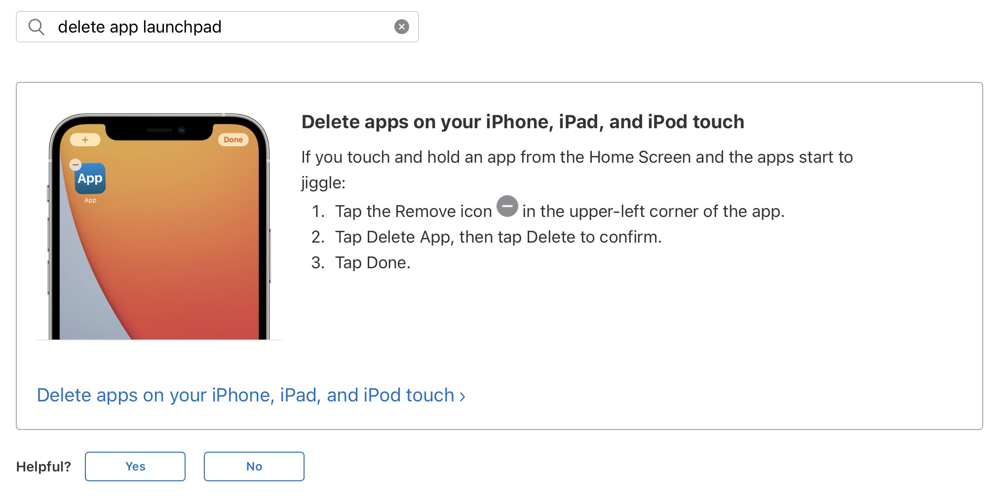

Apple, a company known for innovating so fast that it greatly upsets the mainstream, like when it eliminated [floppy disk drives](https://www.engadget.com/2010-04-28-the-floppy-disk-is-dead-and-apple-helped-kill-it.html) and then [optical drives](https://www.macworld.com/article/219603/apple-and-the-incredible-vanishing-cd-drive.html) has been woefully (and shockingly to me) behind on artificial intelligence. Siri's bad, [sure](https://www.reddit.com/r/iphone/comments/1jehkpm/apple_intelligence_this_apple_intelligence_that/), but there's more to it. Apple's support search is really lacking and isn't yet run by an LLM. Many other support systems I use already swtiched to using an LLM for support. There's even a video on how [to do it](https://www.youtube.com/watch?v=Yhtjd7yGGGA)! How has Apple not accomplished even this simple step?

<!--more-->

Generally speaking, to open an app on  MacOS, I just hit Command-Space (⌘-space) and start typing the app I want to open. Generally, within one or two keystrokes it's the top result and I just hit return. For some reason I was off the beaten path this morning and ended up in Launchpad, an app launcher. It's the grid thingy in the dock or a *four-finger pinch*.[^1] But I didn't even know what it (Launchpad) was called. I wanted to clean it up and make it like my phone home screen for consistency. I like to categorize apps by action, so I have folders called "Read", "Write", "Chat", "Listen", "Watch", etc.
	

[^1]: Apple must be phasing this thing out because a four-finger pinch is exceedingly difficult.

Enter Apple support: I searched for "App Launcher" and got nothing useful. I then searched "App launcher MacOS" (since everything was iOS related), "MacOS 14 App Launcher" (since all the results were old) etc. I was kind of shocked. These search results were bad—forget that there was no chat interface.

For comparison, I went to ChatGPT and asked, "There’s a thing in MacOS that shows you all the apps on one screen?" and it immediately knew I was talking about *Launchpad* (as opposed to app launcher) and gave some brief instructions.

> Yes! You're thinking of Launchpad on macOS. It displays all your installed apps in a grid, similar to the home screen on an iPhone or iPad.

> You can open Launchpad in a few ways:

> 1. Press F4 (or the Launchpad key if your keyboard has one).
> 2. Use a four-finger pinch gesture on the trackpad.
> 3. Click the Launchpad icon in the Dock (it looks like a silver rocket).
> 4. Search for it using Spotlight (Cmd + Space, then type "Launchpad").

Two of these are actually wrong. I'll leave it as an exercise to the reader to figure out which ones, but at least ChatGPT knew what I was talking about. With the Launchpad name now handy, I went back to Apple Support and searched "delete app launchpad". Granted delete was the first search term, but the name launchpad was in there, and I got: 

]